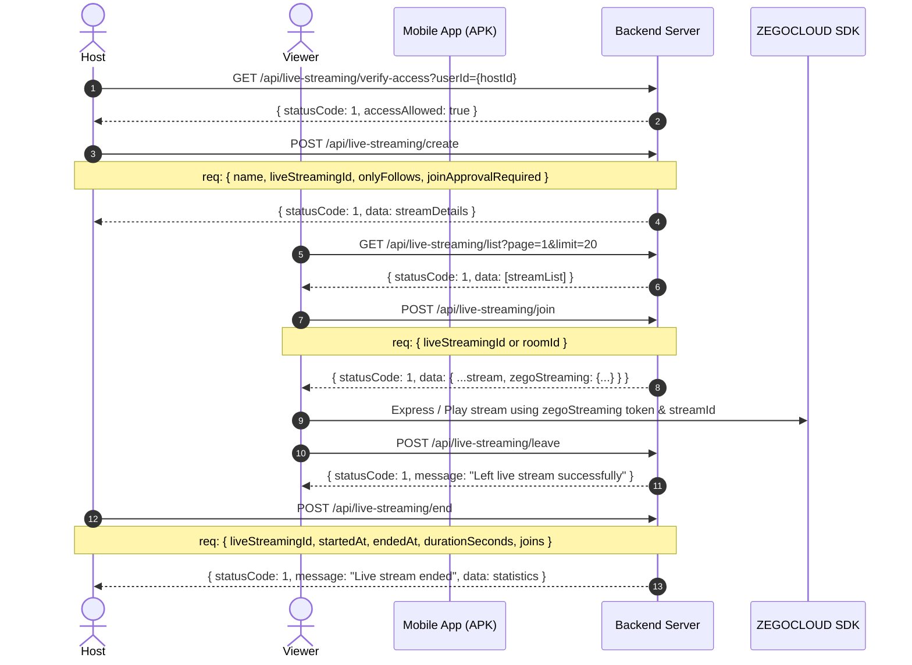

# Qobo1live - Standalone Live Streaming Mobile API Developer Guide (APK Integration Document)

## Overview & Architecture

To maintain high stability and prevent regressions, **Live Streaming APIs are strictly isolated** under `/api/live-streaming/*`. 

> [!IMPORTANT]
> - **Audio Rooms & Video Rooms** use `/api/room/*`.
> - **Live Streaming** uses `/api/live-streaming/*`.
> - Do not mix Audio/Video Room APIs with Live Streaming APIs in mobile development.
> - Authentication header required for all endpoints: `Authorization: Bearer <JWT_TOKEN>`

---

## Base URLs

- **Production Base URL**: `https://my-backend-api-960q.onrender.com`
- **Live Streaming Endpoint Root**: `/api/live-streaming` (or `/api/v1/live-streaming`)

---

## Live Streaming API Flow



---

## Detailed API Endpoints

### 1. Verify Go-Live Access
Check if the user is authorized to start a live stream (e.g. host application status or wallet balance check).

- **Method**: `GET`
- **Endpoint**: `/api/live-streaming/verify-access`
- **Query Parameters**:
  - `userId` (string, optional): Target User ID (defaults to authenticated user).

#### Sample Request
```http
GET /api/live-streaming/verify-access?userId=6aae455a-9bc0-41e3-88dc-a0e86fc2c6f7 HTTP/1.1
Authorization: Bearer <TOKEN>
```

#### Sample Response (Success)
```json
{
  "statusCode": 1,
  "message": "Access allowed: User is an agency host.",
  "data": {
    "accessAllowed": true,
    "isHost": true,
    "message": "Access allowed: User is an agency host."
  }
}
```

---

### 2. Create Live Stream
Start a new live stream session.

- **Method**: `POST`
- **Endpoint**: `/api/live-streaming/create` (or `/api/live-streaming/create-live-streaming`)
- **Headers**: `Content-Type: application/json`

#### Request Body Parameters
| Parameter | Type | Required | Description |
| :--- | :--- | :--- | :--- |
| `name` | String | Yes | Title/Name of the live stream. |
| `liveStreamingId` | String | Yes | Unique string identifier for live stream (e.g. `ls_1787331523501_934491`). |
| `onlyFollows` | Boolean | No | `true` if restricted to host followers only. Default `false`. |
| `joinApprovalRequired` | Boolean | No | `true` if audience must request host approval to join. Default `false`. |
| `coverImage` | String | No | URL of cover image. |

#### Sample Request
```json
{
  "name": "Test Host 3",
  "liveStreamingId": "ls_1787331523501_934491",
  "onlyFollows": false,
  "joinApprovalRequired": false
}
```

#### Sample Response (201 Created)
```json
{
  "statusCode": 1,
  "message": "Live streaming started",
  "data": {
    "id": "11197e1d-be4b-4dc1-a796-0795616e41e6",
    "room_id": "11197e1d-be4b-4dc1-a796-0795616e41e6",
    "roomId": "11197e1d-be4b-4dc1-a796-0795616e41e6",
    "name": "Test Host 3",
    "title": "Test Host 3",
    "liveStreamingId": "ls_1787331523501_934491",
    "live_streaming_id": "ls_1787331523501_934491",
    "zegoLiveId": "ls_1787331523501_934491",
    "zego_live_id": "ls_1787331523501_934491",
    "channelName": "ls_1787331523501_934491",
    "onlyFollows": false,
    "joinApprovalRequired": false,
    "isActive": true,
    "isLive": true,
    "hostId": "6aae455a-9bc0-41e3-88dc-a0e86fc2c6f7",
    "viewerCount": 0,
    "coverImage": null,
    "createdAt": "2026-08-21T22:40:00.000Z",
    "updatedAt": "2026-08-21T22:40:00.000Z"
  }
}
```

---

### 3. Fetch Active Live Streams List
Fetch a paginated list of all active live streams.

- **Method**: `GET`
- **Endpoint**: `/api/live-streaming/list`
- **Query Parameters**:
  - `page` (number, optional): Page number (default: `1`).
  - `limit` (number, optional): Items per page (default: `20`).
  - `search` (string, optional): Search by stream name.

#### Sample Request
```http
GET /api/live-streaming/list?category=trending&page=1&limit=20 HTTP/1.1
Authorization: Bearer <TOKEN>
```

#### Sample Response
```json
{
  "statusCode": 1,
  "message": "Active live streams fetched",
  "data": [
    {
      "id": "11197e1d-be4b-4dc1-a796-0795616e41e6",
      "room_id": "11197e1d-be4b-4dc1-a796-0795616e41e6",
      "roomId": "11197e1d-be4b-4dc1-a796-0795616e41e6",
      "name": "Test Host 3",
      "title": "Test Host 3",
      "liveStreamingId": "ls_1787331523501_934491",
      "live_streaming_id": "ls_1787331523501_934491",
      "zegoLiveId": "ls_1787331523501_934491",
      "hostId": "6aae455a-9bc0-41e3-88dc-a0e86fc2c6f7",
      "hostName": "John Doe",
      "hostAvatar": "https://...",
      "viewerCount": 5,
      "isActive": true,
      "isLive": true
    }
  ],
  "pagination": {
    "page": 1,
    "limit": 20,
    "total": 1,
    "totalPages": 1
  }
}
```

---

### 4. Join Live Stream
Dedicated endpoint to join a live stream as a viewer or host. Accepts either UUID `id`/`roomId` or custom string `liveStreamingId`.

- **Method**: `POST`
- **Endpoint**: `/api/live-streaming/join`

#### Request Body Parameters
| Parameter | Type | Required | Description |
| :--- | :--- | :--- | :--- |
| `liveStreamingId` or `roomId` | String | Yes | Stream UUID (`11197e1d-be4b-4dc1-a796-0795616e41e6`) OR custom string ID (`ls_1787331523501_934491`). |
| `join_request_id` | String | No | Approved join request ID if stream requires host approval. |

#### Sample Request
```json
{
  "roomId": "11197e1d-be4b-4dc1-a796-0795616e41e6",
  "room_id": "11197e1d-be4b-4dc1-a796-0795616e41e6",
  "liveStreamingId": "ls_1787331523501_934491"
}
```

#### Sample Response (200 OK)
```json
{
  "statusCode": 1,
  "message": "Joined live stream successfully",
  "data": {
    "id": "11197e1d-be4b-4dc1-a796-0795616e41e6",
    "room_id": "11197e1d-be4b-4dc1-a796-0795616e41e6",
    "roomId": "11197e1d-be4b-4dc1-a796-0795616e41e6",
    "name": "Test Host 3",
    "liveStreamingId": "ls_1787331523501_934491",
    "live_streaming_id": "ls_1787331523501_934491",
    "zegoLiveId": "ls_1787331523501_934491",
    "isActive": true,
    "isLive": true,
    "hostId": "6aae455a-9bc0-41e3-88dc-a0e86fc2c6f7",
    "zegoStreaming": {
      "appId": 1538269104,
      "appSign": "72022e423995fb9f3bc6d7ef3b084f2eaf421b49477b78048a75dca27ee7d101",
      "roomId": "ls_1787331523501_934491",
      "token": "<BASE64_ZEGO_TOKEN>",
      "streamId": "stream_ls1787331523501934491_viewer123",
      "hostStreamId": "stream_ls1787331523501934491_6aae455a9bc041e388dca0e86fc2c6f7"
    },
    "sessionEarnings": {
      "sessionCoinsEarned": 0,
      "sessionDiamondsEarned": 0,
      "giftCoinsEarned": 0,
      "hostSessionCoins": 0
    }
  }
}
```

---

### 5. Leave Live Stream
Dedicated endpoint to leave a live stream session and update active viewer count.

- **Method**: `POST`
- **Endpoint**: `/api/live-streaming/leave`

#### Sample Request
```json
{
  "roomId": "11197e1d-be4b-4dc1-a796-0795616e41e6",
  "liveStreamingId": "ls_1787331523501_934491"
}
```

#### Sample Response
```json
{
  "statusCode": 1,
  "message": "Left live stream successfully",
  "data": null
}
```

---

### 6. Update Live Stream Status / Settings
Host updates stream settings or pauses the stream.

- **Method**: `PATCH`
- **Endpoint**: `/api/live-streaming/update-live-streaming-status`

#### Sample Request
```json
{
  "liveStreamingId": "ls_1787331523501_934491",
  "isActive": true,
  "name": "Updated Live Title"
}
```

---

### 7. End Live Stream (Host)
Host ends the live stream session and records audience watch statistics.

- **Method**: `POST`
- **Endpoint**: `/api/live-streaming/end`

#### Sample Request
```json
{
  "liveStreamingId": "ls_1787331523501_934491",
  "startedAt": "2026-08-21T22:00:00.000Z",
  "endedAt": "2026-08-21T22:30:00.000Z",
  "durationSeconds": 1800,
  "joins": [
    {
      "userId": "viewer_user_id_1",
      "role": "viewer",
      "joinedAt": "2026-08-21T22:05:00.000Z"
    }
  ]
}
```

#### Sample Response
```json
{
  "statusCode": 1,
  "message": "Live stream ended",
  "data": {
    "id": "11197e1d-be4b-4dc1-a796-0795616e41e6",
    "liveStreamingId": "ls_1787331523501_934491",
    "hostId": "6aae455a-9bc0-41e3-88dc-a0e86fc2c6f7",
    "isLive": false,
    "durationSeconds": 1800,
    "uniqueViewerCount": 1,
    "totalJoinEvents": 1
  }
}
```

---

## Real-Time Socket.IO Events

When a host creates a live stream, the server automatically broadcasts real-time Socket.IO events to all followers:
- Event Name: `live_streaming_created` & `host_live_started`
- Payload:
  ```json
  {
    "category": "ROOM_BROADCAST",
    "type": "live_streaming_created",
    "liveStreamingId": "ls_1787331523501_934491",
    "roomId": "11197e1d-be4b-4dc1-a796-0795616e41e6",
    "hostId": "6aae455a-9bc0-41e3-88dc-a0e86fc2c6f7",
    "hostName": "John Doe",
    "message": "John Doe is now live! Join the stream."
  }
  ```
