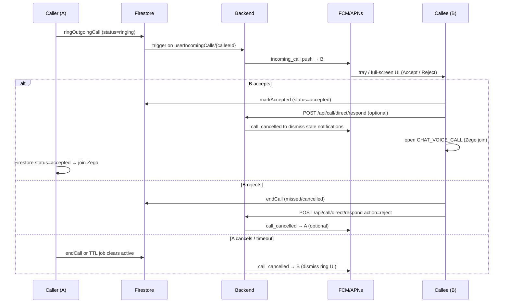

# One-to-One Voice/Video Call — Push Notification API

**Audience:** Backend team + Mobile team  
**Status:** Specification for implementation  
**Last updated:** 2026-08-19

---

## 1. Goal

When **Person A** calls **Person B** in a 1:1 chat voice or video call:

| App state (callee B) | Expected UX |
|----------------------|-------------|
| **Foreground / open** | In-app incoming call dialog (Accept / Decline) — **already implemented** via Firestore |
| **Background** | High-priority push with **Accept** and **Reject** actions; optional full-screen incoming UI (Android) |
| **Terminated / killed** | Same as background — push wakes the app (or shows system call UI) so B can Accept or Reject without opening chat first |

This document defines what **backend must send** and what **mobile will implement**, aligned with existing patterns (`room_invite`, `join_request` push flows).

---

## 2. Current implementation (baseline)

Mobile today **does not** use FCM for 1:1 calls. Signaling is **Firestore-only**:

```
Caller A                          Firestore                           Callee B (app open)
   |                                  |                                      |
   |-- ringOutgoingCall() ----------->| chatRooms/{roomId}/calls/active      |
   |                                  | userIncomingCalls/{calleeId}         |
   |                                  |------------------------------------->| ChatIncomingCallCoordinator
   |                                  |                                      | → in-app Accept / Decline dialog
   |                                  |                                      |
   |-- Zego join (callID) ------------>| (RTC media)                          |-- Zego join after Accept
```

**Firestore paths (mobile writes today):**

| Path | Purpose |
|------|---------|
| `chatRooms/{roomId}/calls/active` | Ephemeral ring / accept / end state |
| `userIncomingCalls/{calleeId}` | Fast lookup so callee rings even outside that chat room |

**Active call document shape (written by mobile on ring):**

```json
{
  "callId": "vc_chat-room-uuid",
  "historyDocId": "call_1734567890123456",
  "callStartedAt": "2026-08-19T06:00:00.000Z",
  "roomId": "chat-room-uuid",
  "callerId": "user-a-id",
  "callerName": "Alex",
  "calleeId": "user-b-id",
  "type": "voice",
  "status": "ringing",
  "recordCallHistory": true,
  "startedAt": "<server timestamp>",
  "updatedAt": "<server timestamp>"
}
```

`type` is `"voice"` or `"video"`.  
`callId` is the **Zego call channel ID** (derived from `roomId`, prefix `vc_`).

**Gap:** When B’s app is backgrounded or killed, Firestore listeners are inactive → **no ring UI**. Backend must deliver an **FCM push** at ring time.

---

## 3. Recommended architecture

### Option A — Firestore trigger (recommended, minimal mobile change)

Mobile keeps writing `userIncomingCalls/{calleeId}` on ring (unchanged).  
Backend **Cloud Function** (or equivalent worker) listens for **create** when `status == "ringing"` and sends FCM to callee.

```
A rings → mobile writes userIncomingCalls/B → Cloud Function → FCM → B's device
B Accept/Reject → mobile updates Firestore (+ optional REST) → Cloud Function cancels push / notifies A
```

**Pros:** No change to caller flow; single source of truth in Firestore.  
**Cons:** Backend must trust Firestore writes (secure with Security Rules + optional server validation).

### Option B — REST-first (optional enhancement)

Caller calls `POST /api/call/direct/start` **before** or **instead of** client-only Firestore write. Server validates wallet, busy state, blocks → writes Firestore → sends FCM.

**Pros:** Strong server-side gating (coins, busy, privacy).  
**Cons:** Requires mobile to call REST on every dial (see §7).

**Either option must use the same FCM payload contract below.**

---

## 4. End-to-end flow (target)



---

## 5. FCM push types

All FCM **`data` values must be strings** (Firebase requirement).

| `type` | Recipient | When to send |
|--------|-----------|--------------|
| **`incoming_call`** | Callee | New ring (`status=ringing`) |
| **`call_cancelled`** | Callee (and optionally caller) | Caller hung up before answer, callee rejected, or server timeout |
| **`call_missed`** | Caller (optional) | Ring TTL expired with no answer |

Mobile will add these to `PushNotificationTypes` (same pattern as `room_invite`, `join_request`).

---

## 6. FCM payload — `incoming_call`

### 6.1 Required `data` fields

```json
{
  "type": "incoming_call",
  "notification_id": "call-ring-uuid-or-call_id",
  "call_id": "vc_chat-room-uuid",
  "room_id": "chat-room-uuid",
  "caller_id": "user-a-id",
  "caller_name": "Alex",
  "caller_avatar": "https://cdn.example.com/avatars/a.jpg",
  "callee_id": "user-b-id",
  "call_type": "voice",
  "zego_call_id": "vc_chat-room-uuid",
  "history_doc_id": "call_1734567890123456",
  "call_started_at": "2026-08-19T06:00:00.000Z",
  "record_call_history": "true",
  "expires_at": "2026-08-19T06:01:00.000Z"
}
```

| Field | Required | Notes |
|-------|:--------:|-------|
| `type` | Yes | Must be `incoming_call` |
| `notification_id` | Yes | Dedup key; use server `callId` or ring event UUID. Same ID for retries |
| `call_id` | Yes | Logical call session ID (matches Firestore `callId`) |
| `room_id` | Yes | Chat room UUID (`chatRooms/{roomId}`) |
| `caller_id` | Yes | Caller's user ID |
| `caller_name` | Yes | Shown on incoming UI |
| `caller_avatar` | Recommended | Full HTTPS URL; empty string if unknown |
| `callee_id` | Yes | Must match push token owner |
| `call_type` | Yes | `voice` or `video` |
| `zego_call_id` | Yes | Zego `callID` both peers join (usually same as `call_id`) |
| `history_doc_id` | Conditional | Required when `record_call_history` is `true` |
| `call_started_at` | Yes | ISO-8601 UTC; used for billing/history continuity |
| `record_call_history` | Yes | `"true"` or `"false"` (string) |
| `expires_at` | Yes | Ring valid until; mobile rejects stale Accept |

Optional (nice to have):

| Field | Purpose |
|-------|---------|
| `caller_country` | UI badge |
| `coins_per_second` | Show rate on incoming screen (caller pays model) |
| `min_wallet_coins` | Warn callee if relevant |

### 6.2 Android delivery

Send **data-only**, **high priority** (same rule as `room_invite`):

```json
{
  "token": "<callee-fcm-token>",
  "data": {
    "type": "incoming_call",
    "notification_id": "ring-uuid",
    "call_id": "vc_room-uuid",
    "room_id": "room-uuid",
    "caller_id": "user-a",
    "caller_name": "Alex",
    "caller_avatar": "https://...",
    "callee_id": "user-b",
    "call_type": "voice",
    "zego_call_id": "vc_room-uuid",
    "history_doc_id": "call_1734567890123456",
    "call_started_at": "2026-08-19T06:00:00.000Z",
    "record_call_history": "true",
    "expires_at": "2026-08-19T06:01:00.000Z"
  },
  "android": {
    "priority": "high",
    "ttl": "45s"
  }
}
```

- **Do not** include top-level FCM `notification` on Android for the data-only path — mobile renders a **local notification** with action buttons.
- Use a dedicated Android notification **channel** (e.g. `incoming_calls`) with **IMPORTANCE_HIGH**, custom ringtone, and **full-screen intent** capability for WhatsApp-like UX.
- `ttl` should match ring timeout (~45–60 seconds).

### 6.3 iOS delivery

iOS needs a visible alert + registered action category:

```json
{
  "token": "<callee-fcm-token>",
  "notification": {
    "title": "Incoming call",
    "body": "Alex is calling you"
  },
  "data": {
    "type": "incoming_call",
    "notification_id": "ring-uuid",
    "call_id": "vc_room-uuid",
    "room_id": "room-uuid",
    "caller_id": "user-a",
    "caller_name": "Alex",
    "caller_avatar": "https://...",
    "callee_id": "user-b",
    "call_type": "voice",
    "zego_call_id": "vc_room-uuid",
    "history_doc_id": "call_1734567890123456",
    "call_started_at": "2026-08-19T06:00:00.000Z",
    "record_call_history": "true",
    "expires_at": "2026-08-19T06:01:00.000Z"
  },
  "apns": {
    "headers": {
      "apns-priority": "10",
      "apns-push-type": "alert"
    },
    "payload": {
      "aps": {
        "category": "INCOMING_CALL",
        "sound": "ringtone.caf",
        "interruption-level": "time-sensitive"
      }
    }
  }
}
```

For **video**, set notification title/body to `"Incoming video call"` / `"Alex is video calling you"`.

**Phase 2 (optional, closer to WhatsApp):** Apple **PushKit (VoIP)** + **CallKit** for lock-screen native call UI. Requires separate VoIP certificate and app changes — document Phase 1 first (notification + actions), Phase 2 as follow-up.

### 6.4 Action identifiers (mobile registers)

| Platform | Category | Actions |
|----------|----------|---------|
| iOS APNs | `INCOMING_CALL` | `ACCEPT_CALL`, `REJECT_CALL` |
| Android local notification | — | `ACCEPT_CALL`, `REJECT_CALL` |

These mirror existing constants pattern (`JOIN_ROOM`, `REJECT_ROOM`, `APPROVE_JOIN`).

---

## 7. Backend REST API (recommended)

Firestore signaling can stay; REST gives reliable **accept/reject from background** and central validation.

Existing stubs in `docs/api/QOBO_CALL_MODULE_API.md` — formalize below.

### 7.1 Start call (optional if using Firestore trigger only)

```http
POST /api/call/direct/start
Authorization: Bearer <caller-token>
Content-Type: application/json
```

**Request:**

```json
{
  "calleeUserId": "user-b-id",
  "callType": "voice",
  "roomId": "chat-room-uuid",
  "clientCallId": "vc_chat-room-uuid",
  "historyDocId": "call_1734567890123456"
}
```

**Server must:**

1. Verify caller wallet balance (caller pays per second).
2. Verify callee is not busy, not blocked, accepts voice/video per profile settings.
3. Write / merge Firestore `calls/active` + `userIncomingCalls/{calleeId}` (Admin SDK) **or** confirm mobile already wrote it.
4. Send `incoming_call` FCM to callee’s registered token(s).
5. Return canonical IDs.

**Success response:**

```json
{
  "statusCode": 1,
  "message": "Ringing",
  "data": {
    "callId": "vc_chat-room-uuid",
    "roomId": "chat-room-uuid",
    "zegoCallId": "vc_chat-room-uuid",
    "historyDocId": "call_1734567890123456",
    "expiresAt": "2026-08-19T06:01:00.000Z",
    "coinsPerSecond": 2
  }
}
```

**Error examples (statusCode 0):**

| Condition | HTTP | Message |
|-----------|------|---------|
| Insufficient coins | 402 | `Insufficient wallet balance` |
| Callee busy | 409 | `User is on another call` |
| Callee disabled video | 403 | `User is not accepting video calls` |
| Blocked | 403 | `Unable to call this user` |

### 7.2 Respond to call (Accept / Reject from push)

```http
POST /api/call/direct/respond
Authorization: Bearer <callee-token>
Content-Type: application/json
```

**Request:**

```json
{
  "callId": "vc_chat-room-uuid",
  "roomId": "chat-room-uuid",
  "action": "accept"
}
```

`action`: `"accept"` | `"reject"`

**Server must:**

1. Verify authenticated user is the **callee** for this active call.
2. Verify call is still `ringing` and not past `expires_at`.
3. **accept:** set Firestore `status=accepted`, clear `userIncomingCalls/{calleeId}`, cancel pending FCM/UI on callee devices.
4. **reject:** clear active call, record missed call history, notify caller (`call_cancelled` optional).
5. Idempotent — repeating the same action returns success without duplicate side effects.

**Success:**

```json
{
  "statusCode": 1,
  "message": "Accepted",
  "data": {
    "callId": "vc_chat-room-uuid",
    "roomId": "chat-room-uuid",
    "zegoCallId": "vc_chat-room-uuid",
    "callerId": "user-a-id",
    "callerName": "Alex",
    "callType": "voice",
    "historyDocId": "call_1734567890123456",
    "callStartedAt": "2026-08-19T06:00:00.000Z"
  }
}
```

Mobile uses this response to open the call screen when Accept is tapped from a killed state (after Firebase auth bootstrap).

### 7.3 End / cancel call

Already specified; use for hang-up and caller cancel:

```http
POST /api/call/direct/end
Authorization: Bearer <token>
Content-Type: application/json
```

```json
{
  "callId": "vc_chat-room-uuid",
  "roomId": "chat-room-uuid",
  "reason": "completed|cancelled|rejected|missed|failed"
}
```

**Server must:** delete Firestore active doc, clear `userIncomingCalls`, send `call_cancelled` to the other party to **dismiss** ringing UI/notifications.

---

## 8. Lifecycle pushes

### 8.1 `call_cancelled`

Send to **callee** when ring should stop (caller cancelled, accepted on another device, server timeout):

```json
{
  "type": "call_cancelled",
  "notification_id": "same-as-incoming-ring-id",
  "call_id": "vc_chat-room-uuid",
  "room_id": "chat-room-uuid",
  "reason": "cancelled"
}
```

`reason`: `cancelled` | `accepted_elsewhere` | `expired`

Mobile **cancels** the local notification / full-screen UI matching `notification_id`. No action buttons.

### 8.2 `call_missed` (optional, to caller)

```json
{
  "type": "call_missed",
  "notification_id": "missed-uuid",
  "call_id": "vc_chat-room-uuid",
  "room_id": "chat-room-uuid",
  "callee_name": "Sam"
}
```

Informational only — no actions required.

---

## 9. When backend should / should not send push

### Send `incoming_call` when:

- New ring document created with `status=ringing`
- Callee has at least one valid FCM token (`POST /api/user/fcm-token`)
- Callee is not already in an active call (server-side busy flag)
- Caller and callee are not blocked

### Do **not** send when:

- Callee is the same user as caller
- Active call already exists for either party
- `expires_at` is in the past
- Callee has disabled incoming voice/video in settings
- Duplicate ring event (same `notification_id` within TTL) — **dedupe**

### Ring timeout

Backend (or scheduled job) should:

1. After **45–60 s** with `status=ringing`, set outcome to **missed**, clear Firestore active doc, send `call_cancelled` to callee and optionally `call_missed` to caller.

---

## 10. FCM token registration (existing)

Mobile already registers tokens:

```http
POST /api/user/fcm-token
Authorization: Bearer <token>
Content-Type: application/json
```

```json
{
  "token": "fcm-device-token",
  "platform": "android"
}
```

`platform`: `"android"` | `"ios"`

**Backend:** Store multiple tokens per user (multi-device). On ring, fan-out to all active tokens. Invalidate tokens on `NotRegistered` / `InvalidRegistration` FCM errors.

---

## 11. Mobile implementation checklist

Mobile team will implement (not backend):

| # | Task |
|---|------|
| 1 | Add `incoming_call`, `call_cancelled`, `call_missed` to `PushNotificationTypes` |
| 2 | Add `INCOMING_CALL` category + `ACCEPT_CALL` / `REJECT_CALL` to `PushNotificationActions` |
| 3 | Extend `PushNotificationService.actionSetForData` → new `callAcceptReject` action set |
| 4 | Create `IncomingCallPushHandler` (mirror `RoomInvitePushHandler`) |
| 5 | Wire handler in `PushNotificationBootstrap` (foreground, background, terminated, action buttons) |
| 6 | **Accept:** sign in to Firebase → `POST /api/call/direct/respond` (or Firestore `markAccepted`) → `Get.toNamed(Routes.CHAT_VOICE_CALL, arguments: { roomId, callId, hostId: callerId, isCaller: false, isVideo, ... })` |
| 7 | **Reject:** `POST /api/call/direct/respond` + Firestore `endCall` → dismiss notification |
| 8 | **Dedup with foreground:** if `ChatIncomingCallCoordinator` already showing dialog for same `call_id`, do not show duplicate tray/full-screen |
| 9 | Android: high-importance channel, ringtone, `fullScreenIntent`, `USE_FULL_SCREEN_INTENT` permission |
| 10 | iOS: register `INCOMING_CALL` category; request critical/time-sensitive alert entitlement if needed |
| 11 | Handle `call_cancelled` → cancel local notification by `notification_id` |
| 12 | Cold start: `flushPendingLaunch` routes Accept action to call screen |

**Existing call screen args (callee accept path):**

```dart
{
  'roomId': roomId,
  'callId': callId,
  'historyDocId': historyDocId,      // when record_call_history
  'callStartedAt': callStartedAt,
  'hostId': callerId,                // billing: callee earns from caller
  'peerName': callerName,
  'isCaller': false,
  'isVideo': callType == 'video',
  'recordCallHistory': true,
}
```

**Billing reminder:** Caller pays per second (`POST /api/economy/calling/charge` with `host_id` = callee). No change needed for push — same call session IDs must flow through push payload.

---

## 12. Security & product rules

1. **Never** put Zego tokens in FCM payload unless your project requires them pre-join (current chat flow generates tokens client-side via Zego SDK).
2. Validate **callee_id** matches the authenticated user on `respond`.
3. Validate **caller_id** owns the ring on `end` / `cancel`.
4. Rate-limit: max N concurrent rings per user; cooldown after repeated missed calls (optional).
5. Respect block list and report status server-side before sending push.
6. `notification_id` + `call_id` must be stable for the whole ring session so cancel push dismisses the correct UI.
7. Log push send / accept / reject for support and anti-abuse.

---

## 13. Firestore reference (for Cloud Functions)

```
chatRooms/{roomId}/calls/active     ← status: ringing | accepted | (deleted on end)
userIncomingCalls/{calleeUserId}    ← mirror of active ring; deleted on accept/end
chatRooms/{roomId}/callHistory/{historyDocId}  ← written on end (mobile today)
```

**Suggested Cloud Function pseudo-logic:**

```javascript
exports.onIncomingCallRing = functions.firestore
  .document('userIncomingCalls/{calleeId}')
  .onCreate(async (snap, context) => {
    const data = snap.data();
    if (data.status !== 'ringing') return;
    const tokens = await getFcmTokens(context.params.calleeId);
    await sendIncomingCallPush(tokens, mapToFcmData(data));
  });

exports.onIncomingCallClear = functions.firestore
  .document('userIncomingCalls/{calleeId}')
  .onDelete(async (snap, context) => {
    // optional: send call_cancelled if still ringing
  });
```

---

## 14. Testing checklist

### Backend

- [ ] Ring creates FCM with all required string fields
- [ ] Android data-only high priority; iOS category `INCOMING_CALL`
- [ ] Duplicate ring does not spam (same `notification_id`)
- [ ] Caller cancel sends `call_cancelled` to callee
- [ ] Timeout marks missed and clears Firestore
- [ ] Accept/respond is idempotent
- [ ] Wrong user cannot accept someone else's call
- [ ] Busy callee does not receive second ring push
- [ ] Invalid FCM token removed from DB

### Mobile

- [ ] Foreground: Firestore dialog still works; no double UI if push also arrives
- [ ] Background: Accept opens call screen and connects Zego
- [ ] Background: Reject clears ring and shows missed in chat history
- [ ] Terminated: Accept from notification action cold-starts into call
- [ ] Terminated: Reject works without opening app UI
- [ ] Expired `expires_at`: Accept shows error, no Zego join
- [ ] Video vs voice copy and icons correct
- [ ] `call_cancelled` dismisses ringing notification

---

## 15. Decisions needed from backend

Please confirm:

1. **Trigger:** Firestore Cloud Function on `userIncomingCalls` **vs** mandatory `POST /api/call/direct/start`?
2. **Ring TTL:** 45 s or 60 s?
3. **Multi-device:** Ring all devices or only most recently active token?
4. **iOS Phase 1:** Notification + actions only, or VoIP/CallKit in scope now?
5. **Caller notification:** Send `call_missed` push to caller or rely on in-app/history only?
6. **Server-side busy flag:** Source of truth (DB field vs Firestore active call scan)?

---

## 16. Related docs

| Document | Relevance |
|----------|-----------|
| `docs/api/QOBO_CALL_MODULE_API.md` | Call hub REST, billing, push note §5.5 |
| `docs/ROOM_INVITE_PUSH_NOTIFICATION_BACKEND_REQUIREMENTS.md` | FCM data-only Android pattern |
| `docs/HOST_JOIN_APPROVAL_BACKEND_REQUIREMENTS.md` | Approve/Reject push pattern |
| `docs/chat/12-backend-chat-complete-api-handover.md` | `POST /api/user/fcm-token` |
| Mobile: `lib/services/chat/chat_call_service.dart` | Firestore signaling |
| Mobile: `lib/services/chat/chat_incoming_call_coordinator.dart` | Foreground incoming UI |

---

## 17. Summary for backend team

**Minimum to ship WhatsApp-like incoming calls:**

1. Listen for new 1:1 ring events (`userIncomingCalls/{calleeId}` with `status=ringing`).
2. Send **`incoming_call`** FCM to callee token(s) using the payload in §6.
3. Implement **`POST /api/call/direct/respond`** (accept/reject) with Firestore sync.
4. On cancel/timeout/accept, send **`call_cancelled`** with the same `notification_id` to dismiss callee UI.
5. Enforce wallet, busy, block, and expiry server-side before pushing.

Mobile will handle tray actions, full-screen incoming UI, and navigation into the existing Zego call screen using the IDs in the push payload.
