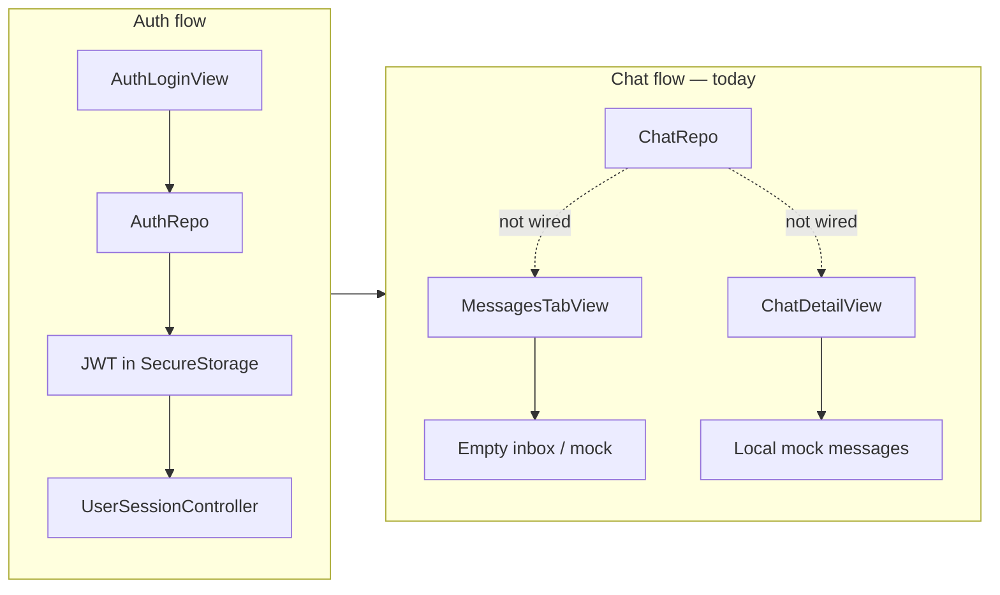
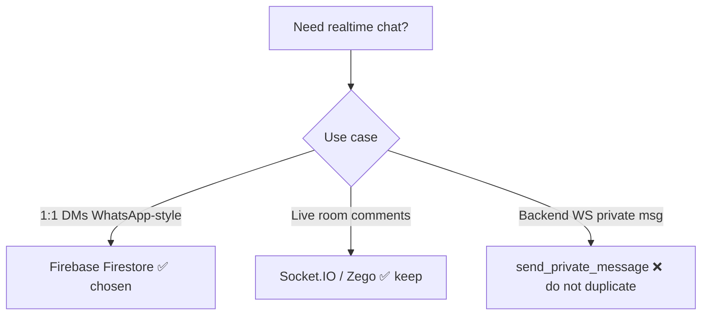

# 01 — Project Analysis (Current State)

Last updated: 2026-06-06

This document summarizes what **already exists** in Qobo One Live for chat, auth, and realtime — so new work builds on the current codebase instead of duplicating it.

---

## Backend overview

| Item | Value |
| --- | --- |
| Base URL | `https://my-backend-api-960q.onrender.com` |
| Auth | JWT Bearer on protected routes |
| Database | PostgreSQL (Prisma) — includes `Block`, user profiles, etc. |
| Documented chat REST | `GET /api/chat/list`, `GET /api/chat/detail` |
| Documented realtime | Socket.IO `send_private_message` (writes to PostgreSQL) — **not used in Flutter yet** |
| Firebase login API | `POST /api/auth/firebase-login` (optional auth path; Firebase SDK not in app yet) |

---

## Mobile overview



| Area | Status | Notes |
| --- | --- | --- |
| **Login** | Done | REST → JWT via `AuthSessionHelper` |
| **ChatRepo** | Partial | `getInbox()`, `getConversation()` exist; controllers don't call them |
| **MessagesTabView** | UI only | Inbox list is hardcoded empty `const messages = []` |
| **ChatDetailView** | UI only | `ChatDetailController.sendMessage()` adds local mock data |
| **Firebase packages** | Not added | No `firebase_core`, `cloud_firestore` in `pubspec.yaml` |
| **Socket.IO client** | Not added | Backend docs mention WS; mobile has no socket chat client |
| **Block user** | Repo ready | `UserRepo.blockUser()` / `unblockUser()` exist |
| **Entry to chat** | Partial | `CallView` navigates to `Routes.CHAT_DETAIL` without `roomId` |

---

## Existing Flutter files

### REST layer

```
lib/services/api_constants.dart     → ChatEndpoints.list, .detail
lib/repo/chat/chat_repo.dart        → getInbox(), getConversation()
lib/services/header_data.dart       → Bearer token on API calls
lib/services/user_session_controller.dart → userId from profile `id`
```

### UI layer

```
lib/app/user_flow/messages/messages_tab/
  views/messages_tab_view.dart      → inbox + new matches row
  controllers/messages_tab_controller.dart → new matches via searchUsers only

lib/app/user_flow/messages/chat_detail/
  views/chat_detail_view.dart       → bubbles + input (mock)
  controllers/chat_detail_controller.dart → local ChatMessageModel list
```

### Routes

```
Routes.CHAT_DETAIL = '/chat-detail'
Opened from: CallView, call_controller (no room args yet)
```

---

## Backend chat API (documented today)

From `docs/developer_api_handover.md` — Category B:

### Inbox list

```
GET /api/chat/list
Authorization: Bearer {token}
```

Response shape (simplified):

```json
{
  "success": true,
  "data": [
    {
      "id": "partner-user-uuid",
      "lastMessage": "Hello there!",
      "lastMessageTime": "2026-05-25T05:12:31.000Z",
      "lastMessageType": "text",
      "unreadCount": 2,
      "recipient": {
        "id": "partner-user-uuid",
        "name": "Jane Doe",
        "displayPicture": "..."
      }
    }
  ]
}
```

### Message history

```
GET /api/chat/detail?target_id={partnerUuid}&page=1
Authorization: Bearer {token}
```

Marks unread as read on fetch (per backend docs).

---

## API response format inconsistency

The app uses **multiple success conventions**. Chat integration should normalize early:

| Source | Success indicator |
| --- | --- |
| Auth flows (`AuthSessionHelper`) | `statusCode == 1` |
| Most repos (`ApiResponseUtils`) | HTTP 200 + body `statusCode == 201` |
| Chat handover doc | `success: true` |

**Recommendation:** New chat endpoints should use `statusCode: 201` + `data` to match `ApiResponseUtils`. Chat parsers should accept legacy shapes during migration.

---

## Realtime options in the codebase



| Path | Where documented | Mobile status |
| --- | --- | --- |
| Socket.IO private message | `docs/developer_api_handover.md` | Not integrated |
| Socket.IO live room | LIVE-* in IMPLEMENTATION_TRACKER | Partial (live broadcast) |
| Zego ZIM | `lib/constants/zego_config.dart` | Disabled (`useSignalingPlugin = false`) |
| **Firebase chat (planned)** | This `docs/chat/` folder | Not started |

**Decision:** Use **Firebase for DMs**; keep **Socket.IO for live streaming** only. Do not run Socket.IO and Firestore for the same 1:1 conversation.

---

## Gaps to close (summary)

| # | Gap | Owner |
| --- | --- | --- |
| 1 | Wire `ChatRepo` to Messages tab + Chat detail | Mobile — Phase 1 |
| 2 | `POST /api/chat/room` + `POST /api/chat/firebase-token` | Backend — Phase 2 |
| 3 | Firestore schema + Security Rules | Backend — Phase 2–3 |
| 4 | Replace mock send with Firestore writes | Mobile — Phase 3 |
| 5 | Media upload (Storage) | Both — Phase 4 |
| 6 | FCM push | Both — Phase 6 |
| 7 | Pass `roomId` / `targetUserId` into `ChatDetailView` | Mobile — Phase 2 |

---

## Next document

→ [02 — Architecture](./02-architecture.md)
