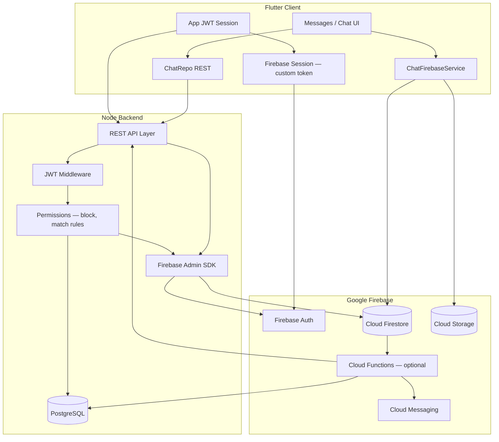
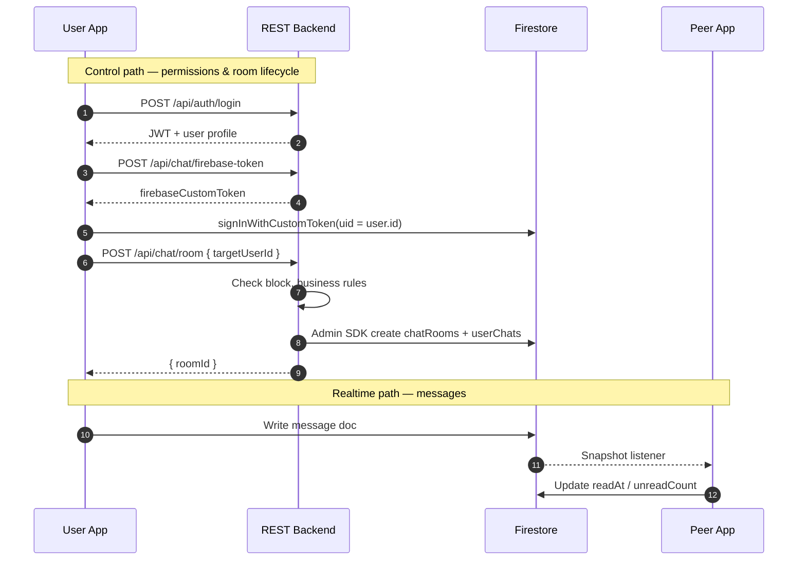
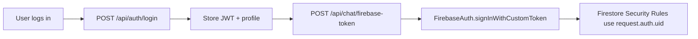
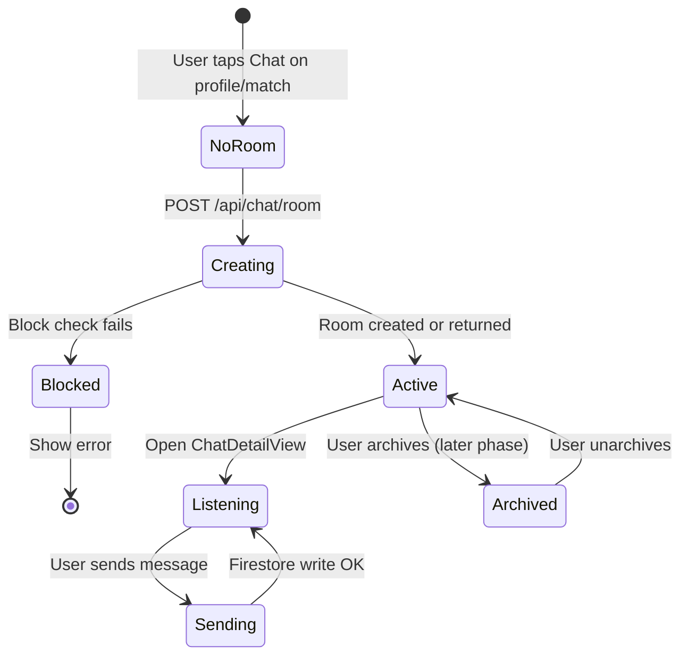
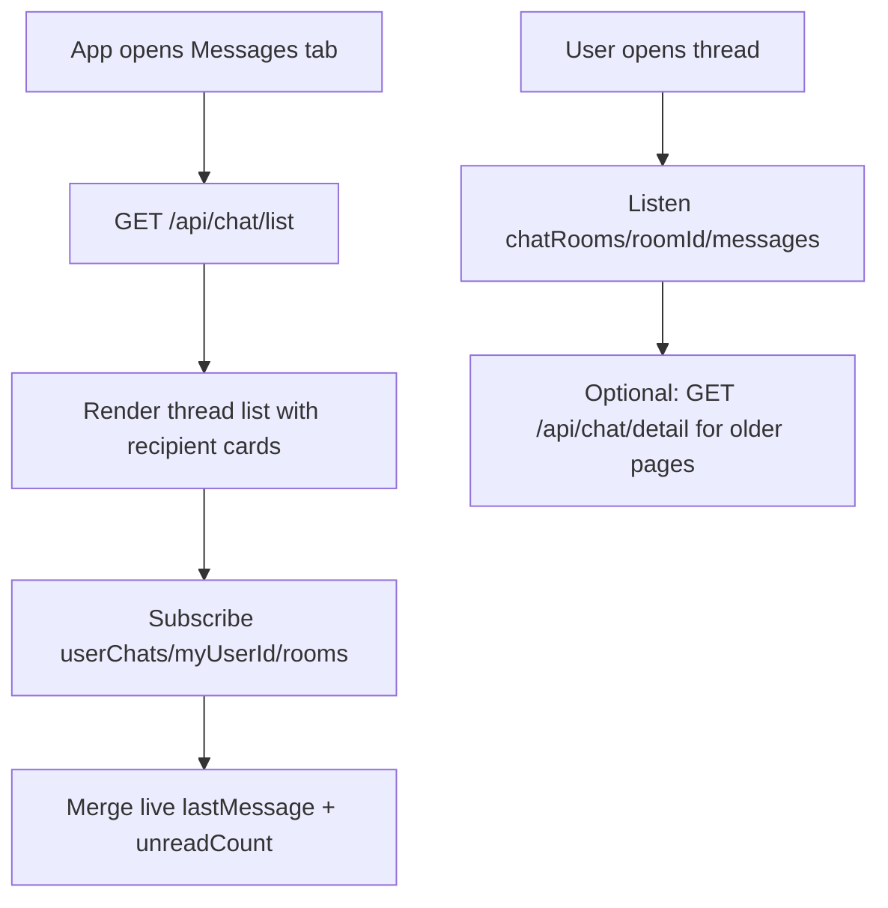
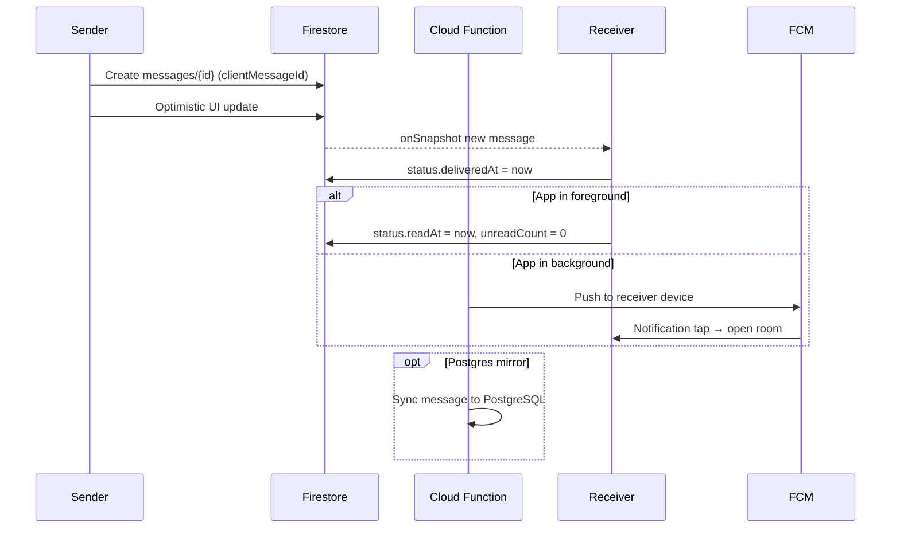
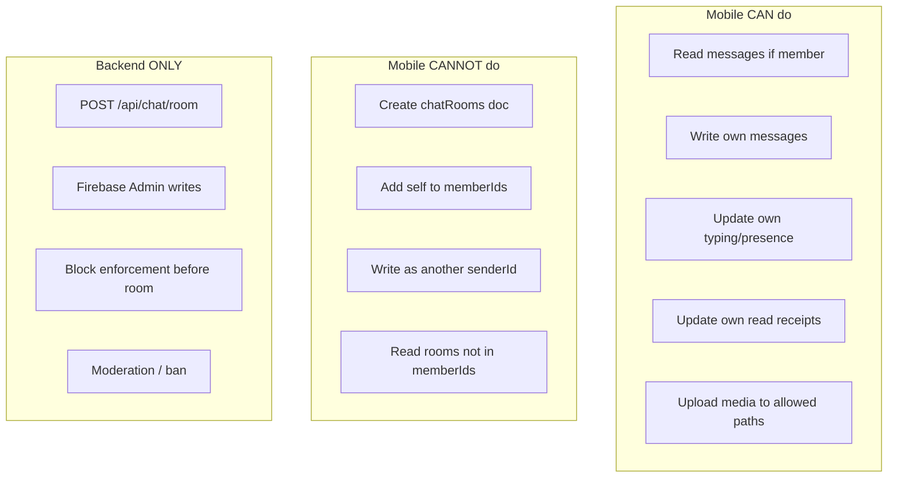
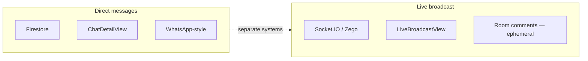

# 02 — Architecture (Firebase + REST)

Last updated: 2026-06-06

Hybrid architecture: **REST controls who can chat**; **Firebase delivers messages in realtime**.

---

## High-level system diagram



---

## Two paths: control vs realtime



| Path | Protocol | Used for |
| --- | --- | --- |
| **Control** | REST + JWT | Login, create room, inbox bootstrap, block, report, FCM token register |
| **Realtime** | Firestore | Send/receive messages, typing, presence, live last-message updates |
| **Media** | Firebase Storage | Images, video, voice notes, documents |
| **Push** | FCM | Notify when app is backgrounded |

---

## Authentication model

Your app **does not** switch to Firebase-only login.



Rules:

- `request.auth.uid` **must equal** PostgreSQL `User.id` (UUID string).
- Backend mints custom token with that UID via Firebase Admin SDK.
- If JWT expires (401), app clears session — Firebase sign-out should happen in the same flow.

Code references today:

- JWT storage: `lib/utils/auth/auth_session_helper.dart`, `lib/services/header_data.dart`
- User id: `lib/services/user_session_controller.dart` → `userId` from `id`

---

## Chat room lifecycle



**1:1 room ID** (computed by backend, never by mobile alone):

```
roomId = "{min(userA, userB)}_{max(userA, userB)}"
```

Example: users `aaa-111` and `zzz-999` → `aaa-111_zzz-999`.

---

## Inbox strategy



| When | Source | Why |
| --- | --- | --- |
| Cold start / pull-to-refresh | REST `/api/chat/list` | Fast; includes profile enrichment |
| App foreground | Firestore `userChats` | Live unread + last message |
| Scroll up in chat | REST `/api/chat/detail?page=N` | Deep history beyond Firestore window |
| Active chat tail | Firestore `messages` subcollection | Realtime send/receive |

---

## Message send flow



---

## Security boundaries



Firestore Security Rules enforce membership; room creation stays server-side.

---

## Live streaming vs DM chat



Do not merge live room comment storage with DM `chatRooms` unless product explicitly requires it.

---

## Optional Cloud Functions

| Trigger | Purpose |
| --- | --- |
| `onCreate` message | Update `lastMessage`, increment `unreadCount`, send FCM |
| `onUpdate` read status | Sync delivery/read to PostgreSQL |
| `onSchedule` | Delete expired disappearing messages |
| `onCreate` report webhook | Alert moderators |

Functions are **optional in Phase 3** but recommended before production scale.

---

## Flutter module layout (target)

```
lib/
  services/chat/
    chat_firebase_service.dart    # Custom token, Firestore streams, send
    chat_media_service.dart       # Storage uploads
    chat_fcm_service.dart         # Phase 6
  repo/chat/
    chat_repo.dart                # REST: list, detail, room, firebase-token
    models/
      chat_room_model.dart
      chat_message_model.dart
  app/user_flow/messages/         # existing GetX modules
```

Matches project conventions: `bindings/`, `controllers/`, `views/`, `repo/`.

---

## Next documents

- Schema details → [03 — Firestore schema](./03-firestore-schema.md)
- Rollout timeline → [04 — Phase-wise plan](./04-phase-wise-plan.md)
- API list → [06 — API reference](./06-api-reference.md)
