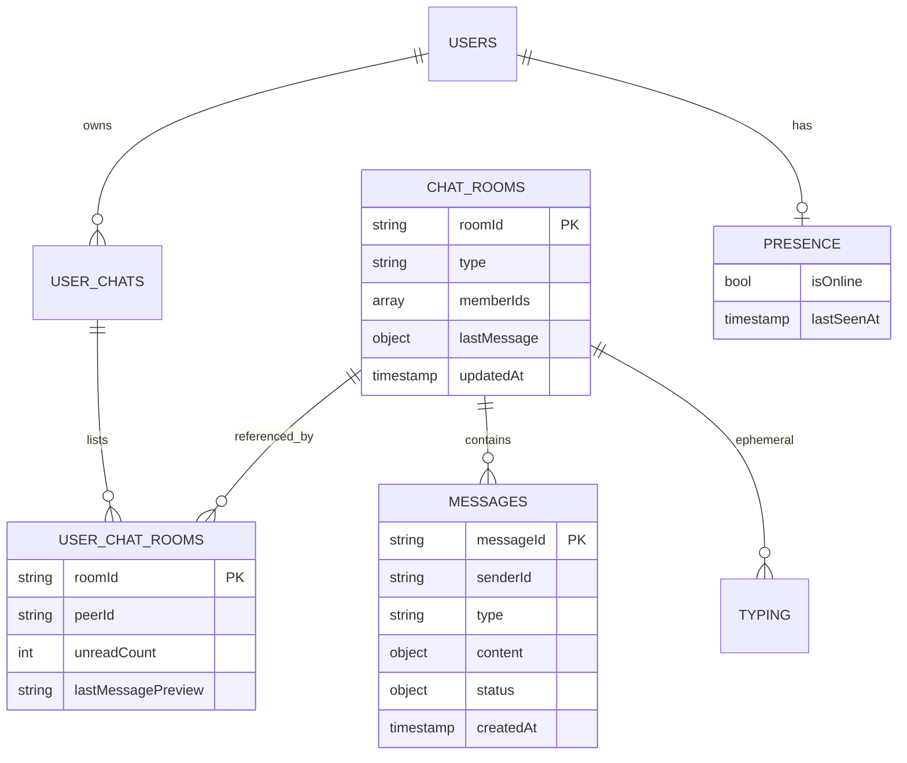
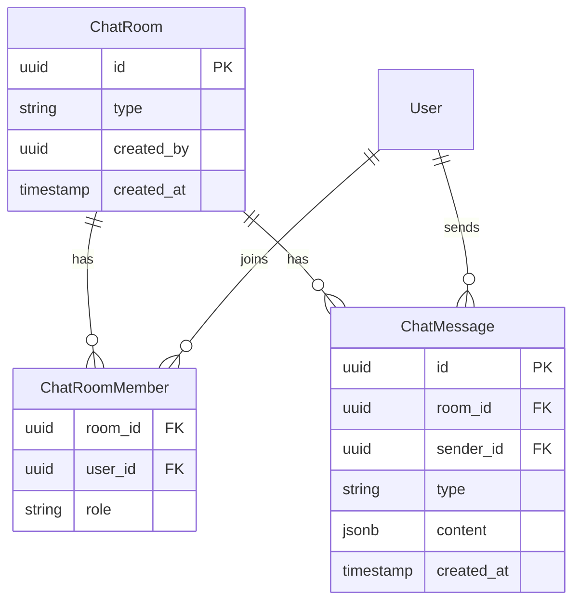

# 03 — Firestore Schema

Last updated: 2026-06-06

Data model for WhatsApp-style chat. All IDs use your backend **PostgreSQL user UUID** as the Firebase Auth UID.

---

## Collection tree



---

## Path reference

```
chatRooms/{roomId}
chatRooms/{roomId}/messages/{messageId}
chatRooms/{roomId}/typing/{userId}

userChats/{userId}/rooms/{roomId}

users/{userId}/presence/main
users/{userId}/settings/chat/{roomId}     # later: mute, pin, archive
```

---

## Firebase Storage paths

```
/chatRooms/{roomId}/messages/{messageId}/original.{ext}
/chatRooms/{roomId}/messages/{messageId}/thumb.jpg
/groups/{roomId}/photo.jpg                 # Phase 7 — group avatar
```

---

## Document: `chatRooms/{roomId}`

Created by **backend Admin SDK** only (`POST /api/chat/room`).

```json
{
  "roomId": "uuid-a_uuid-b",
  "type": "direct",
  "createdAt": "2026-06-06T10:00:00.000Z",
  "createdBy": "uuid-a",
  "updatedAt": "2026-06-06T12:30:00.000Z",

  "memberIds": ["uuid-a", "uuid-b"],
  "memberCount": 2,

  "lastMessage": {
    "messageId": "msg_abc123",
    "senderId": "uuid-b",
    "type": "text",
    "preview": "Hello there!",
    "createdAt": "2026-06-06T12:30:00.000Z"
  },

  "group": null,

  "settings": {
    "disappearingSeconds": 0,
    "onlyAdminsCanSend": false
  },

  "isActive": true
}
```

### Group room (Phase 7) — extra `group` object

```json
{
  "type": "group",
  "group": {
    "name": "Agency Hosts",
    "photoUrl": "https://...",
    "adminIds": ["uuid-a"],
    "description": ""
  }
}
```

---

## Document: `chatRooms/{roomId}/messages/{messageId}`

Full schema supporting WhatsApp-style features. Phase 3 uses the **minimum** subset (see below).

```json
{
  "messageId": "msg_abc123",
  "roomId": "uuid-a_uuid-b",
  "senderId": "uuid-a",

  "type": "text",

  "content": {
    "text": "Hello!",
    "caption": ""
  },

  "media": {
    "url": "gs://bucket/chatRooms/.../image.jpg",
    "downloadUrl": "https://...",
    "mimeType": "image/jpeg",
    "fileName": "photo.jpg",
    "sizeBytes": 245000,
    "durationSec": 0,
    "width": 1080,
    "height": 1920,
    "thumbnailUrl": "https://..."
  },

  "replyTo": {
    "messageId": "msg_prev",
    "senderId": "uuid-b",
    "preview": "Previous message",
    "type": "text"
  },

  "forwarded": {
    "isForwarded": false,
    "forwardCount": 0
  },

  "reactions": {
    "❤️": ["uuid-b"]
  },

  "status": {
    "uuid-b": {
      "deliveredAt": "2026-06-06T12:30:01.000Z",
      "readAt": "2026-06-06T12:31:00.000Z"
    }
  },

  "deliveryState": "sent",

  "edit": {
    "isEdited": false,
    "editedAt": null,
    "originalText": null
  },

  "delete": {
    "isDeletedForEveryone": false,
    "deletedAt": null,
    "deletedBy": null,
    "deletedFor": []
  },

  "expiresAt": null,
  "createdAt": "2026-06-06T12:30:00.000Z",
  "clientCreatedAt": "2026-06-06T12:30:00.000Z",
  "clientMessageId": "local-uuid-for-dedupe"
}
```

### Message types (`type` field)

| Value | Description |
| --- | --- |
| `text` | Plain text |
| `image` | Photo with optional caption |
| `video` | Video file + thumbnail |
| `audio` | Voice note (`durationSec` required) |
| `document` | PDF, etc. |
| `location` | Lat/lng in `content` |
| `contact` | Shared contact card |
| `sticker` | Sticker pack item |
| `system` | "User joined", "Message deleted" |

### Phase 3 minimum fields

```json
{
  "senderId": "uuid-a",
  "type": "text",
  "content": { "text": "Hello" },
  "deliveryState": "sent",
  "status": { "uuid-b": { "deliveredAt": null, "readAt": null } },
  "createdAt": "<serverTimestamp>",
  "clientMessageId": "<uuid>"
}
```

---

## WhatsApp feature mapping

```mermaid
flowchart LR
    subgraph Features["WhatsApp feature"]
        F1[Single tick]
        F2[Double tick]
        F3[Blue ticks]
        F4[Reply]
        F5[Forward]
        F6[Delete for me]
        F7[Delete for everyone]
        F8[Edit]
        F9[Reactions]
        F10[Typing...]
        F11[Last seen]
    end

    subgraph Fields["Firestore field"]
        P1[deliveryState sent]
        P2[status.deliveredAt]
        P3[status.readAt]
        P4[replyTo]
        P5[forwarded.isForwarded]
        P6[delete.deletedFor]
        P7[delete.isDeletedForEveryone]
        P8[edit.isEdited]
        P9[reactions]
        P10[typing/{userId}]
        P11[presence.lastSeenAt]
    end

    F1 --> P1
    F2 --> P2
    F3 --> P3
    F4 --> P4
    F5 --> P5
    F6 --> P6
    F7 --> P7
    F8 --> P8
    F9 --> P9
    F10 --> P10
    F11 --> P11
```

| Feature | Phase | Field / path |
| --- | --- | --- |
| Read receipts | 5a | `status.{userId}.deliveredAt`, `readAt` |
| Typing indicator | 5b | `chatRooms/{roomId}/typing/{userId}` |
| Reply / quote | 5c | `replyTo` |
| Delete for me | 5d | `delete.deletedFor[]` |
| Delete for everyone | 5d | `delete.isDeletedForEveryone` (15 min rule in Security Rules) |
| Edit message | 5e | `edit.*` + updated `content.text` |
| Reactions | 5f | `reactions` map |
| Online / last seen | 5g | `users/{userId}/presence/main` |
| Mute / pin / archive | 5h | `userChats/{userId}/rooms/{roomId}` |
| Disappearing messages | 7 | `expiresAt` + Cloud Function cleanup |

---

## Document: `userChats/{userId}/rooms/{roomId}`

Per-user inbox row (denormalized for fast queries).

```json
{
  "roomId": "uuid-a_uuid-b",
  "type": "direct",
  "peerId": "uuid-b",
  "title": "Jane Doe",
  "photoUrl": "https://my-backend-api-960q.onrender.com/uploads/...",
  "lastMessagePreview": "Hello there!",
  "lastMessageAt": "2026-06-06T12:30:00.000Z",
  "lastMessageType": "text",
  "lastMessageSenderId": "uuid-b",
  "unreadCount": 2,
  "isPinned": false,
  "isMuted": false,
  "isArchived": false,
  "updatedAt": "2026-06-06T12:30:00.000Z"
}
```

Maps to existing REST inbox shape from `GET /api/chat/list`:

| REST field | Firestore field |
| --- | --- |
| `id` (partner id) | `peerId` |
| `lastMessage` | `lastMessagePreview` |
| `lastMessageTime` | `lastMessageAt` |
| `lastMessageType` | `lastMessageType` |
| `unreadCount` | `unreadCount` |
| `recipient.*` | `title`, `photoUrl` (+ fetch from API if stale) |

---

## Document: `chatRooms/{roomId}/typing/{userId}`

Ephemeral — client clears after 3–5 seconds or on send.

```json
{
  "userId": "uuid-a",
  "isTyping": true,
  "updatedAt": "2026-06-06T12:30:00.000Z"
}
```

---

## Document: `users/{userId}/presence/main`

```json
{
  "isOnline": true,
  "lastSeenAt": "2026-06-06T12:30:00.000Z",
  "platform": "android"
}
```

---

## PostgreSQL mirror (backend)

Optional but recommended for search, analytics, and existing REST history.



Sync via Cloud Function `onCreate` on Firestore messages, or a backend worker.

---

## Security Rules (reference sketch)

```javascript
rules_version = '2';
service cloud.firestore {
  match /databases/{database}/documents {

    function isMember(roomId) {
      return request.auth != null
        && request.auth.uid in get(/databases/$(database)/documents/chatRooms/$(roomId)).data.memberIds;
    }

    match /chatRooms/{roomId} {
      allow read: if isMember(roomId);
      allow create, update: if false; // backend Admin SDK only

      match /messages/{messageId} {
        allow read: if isMember(roomId);
        allow create: if isMember(roomId)
          && request.resource.data.senderId == request.auth.uid;
        allow update: if isMember(roomId);
      }

      match /typing/{userId} {
        allow read: if isMember(roomId);
        allow write: if request.auth.uid == userId && isMember(roomId);
      }
    }

    match /userChats/{userId}/rooms/{roomId} {
      allow read, update: if request.auth.uid == userId;
      allow create: if false;
    }

    match /users/{userId}/presence/{doc} {
      allow read: if request.auth != null;
      allow write: if request.auth.uid == userId;
    }
  }
}
```

Tighten `update` rules in Phase 5 for edit/delete windows.

---

## Next document

→ [04 — Phase-wise plan](./04-phase-wise-plan.md)
