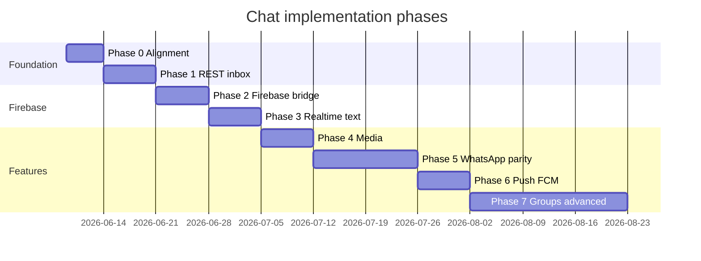
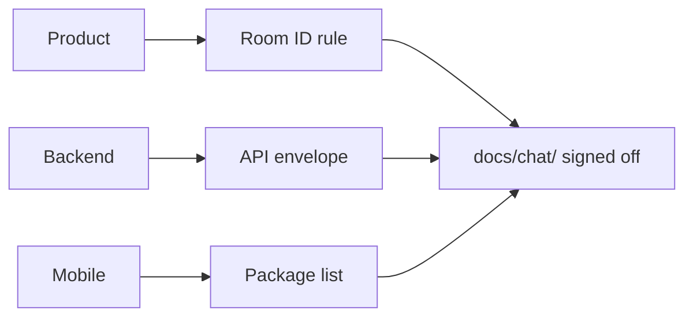
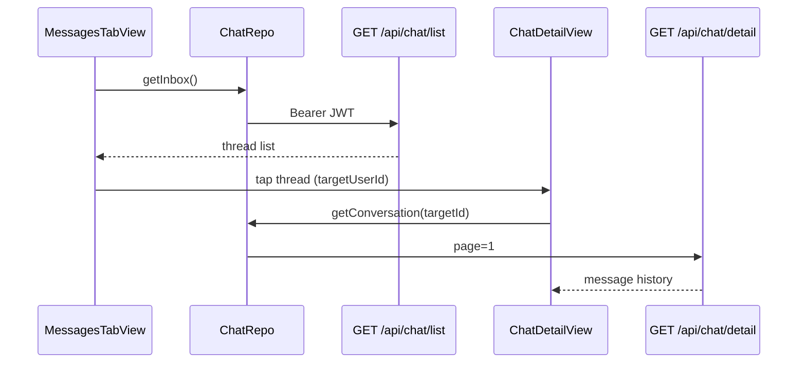
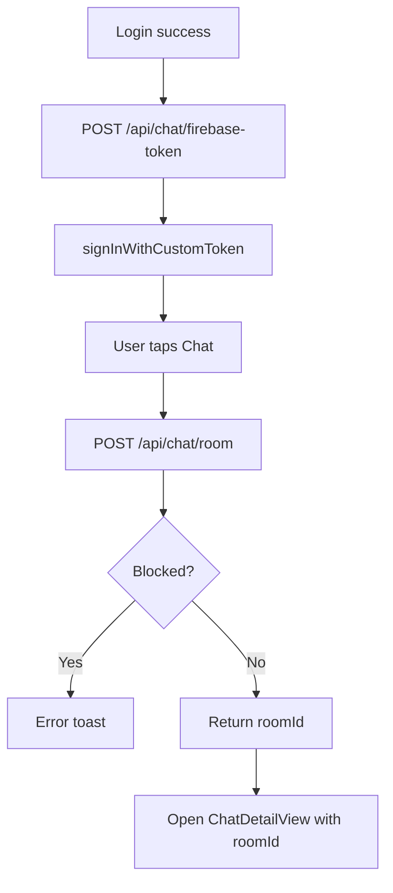
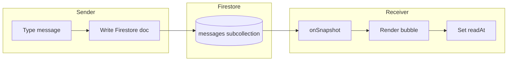
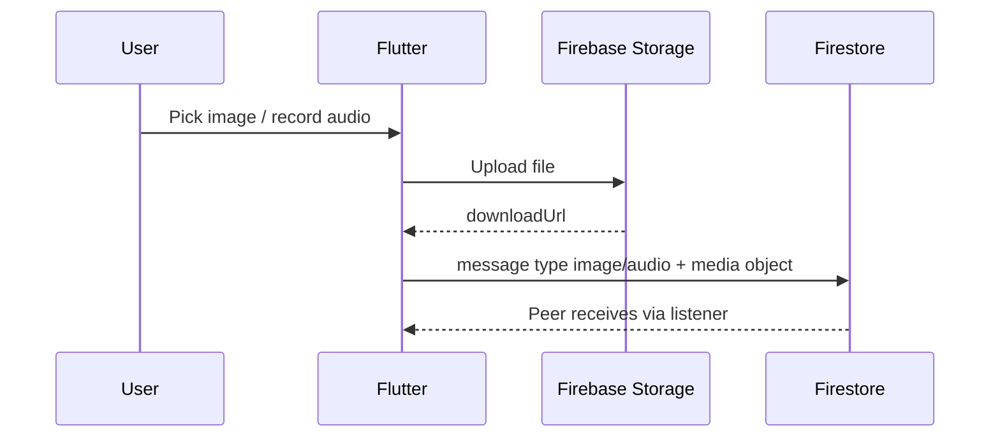
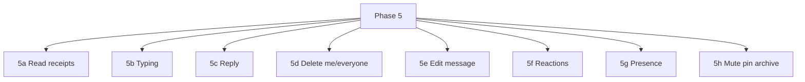
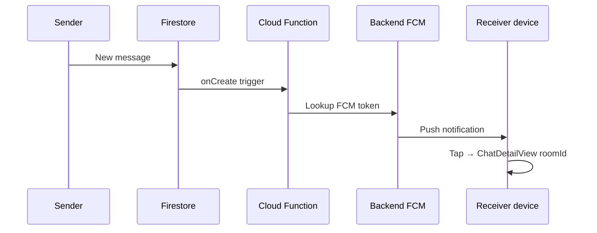
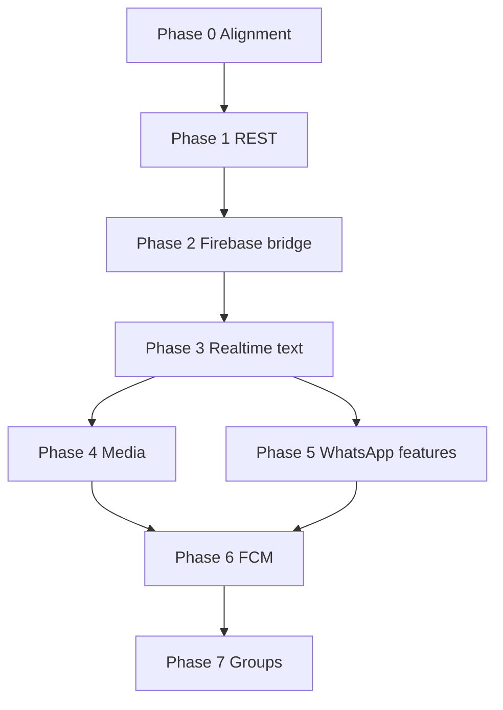

# 04 — Phase-wise Implementation Plan

Last updated: 2026-06-06

Incremental rollout from **REST-only inbox** to **full WhatsApp-style chat**. Each phase has clear owners and exit criteria.

---

## Overview timeline

Adjust dates with your sprint calendar. Phases 5–7 can overlap sub-features.

---

## Phase 0 — Alignment (≈1 week)

**Goal:** Same contract across backend, mobile, and product before coding.

| Task | Owner |
| --- | --- |
| Confirm Firebase for DMs (not Socket.IO for 1:1) | All |
| Confirm `User.id` = Firebase UID | Backend |
| Standardize new APIs on `statusCode: 201` + `data` | Backend |
| Choose Firebase project (`qobo1live-914ac` or new) | DevOps |
| List Flutter packages to add | Mobile |

**Exit criteria:** Backend + mobile leads sign off on [02 — Architecture](./02-architecture.md) and [03 — Firestore schema](./03-firestore-schema.md).

---

## Phase 1 — Wire existing REST (no Firebase)

**Goal:** Inbox and history work with APIs you already have.

| Owner | Deliverable |
| --- | --- |
| **Backend** | Stable `GET /api/chat/list` + `GET /api/chat/detail` |
| **Mobile** | `MessagesTabController` → `ChatRepo.getInbox()` |
| **Mobile** | `ChatDetailController` → `getConversation()` + pagination |
| **Mobile** | Map API response → `MessageListItemModel` / bubble UI |
| **Mobile** | Pass args: `targetUserId`, `name`, `imageUrl` |

**Files to touch:**

- `lib/app/user_flow/messages/messages_tab/controllers/messages_tab_controller.dart`
- `lib/app/user_flow/messages/chat_detail/controllers/chat_detail_controller.dart`
- `lib/app/user_flow/call/` — pass partner id when opening chat

**Exit criteria:** User sees real inbox and history from API. Send may still be disabled or show "coming soon".

---

## Phase 2 — Firebase bridge + room API

**Goal:** After REST login, app can access Firestore; rooms created only by backend.

| Owner | Deliverable |
| --- | --- |
| **Backend** | `POST /api/chat/firebase-token` |
| **Backend** | `POST /api/chat/room` + Admin SDK writes |
| **Backend** | Block check via `Block` table |
| **Backend** | Firestore Security Rules v1 |
| **Mobile** | Add Firebase packages + `google-services` config |
| **Mobile** | `ChatFirebaseService` — init + custom token sign-in |
| **Mobile** | `ChatRepo.createRoom()` before opening chat |
| **Mobile** | Route args include `roomId` |

**Exit criteria:** Login → Firebase session active → create room API returns `roomId` → Firestore documents exist.

---

## Phase 3 — Realtime 1:1 text (MVP)

**Goal:** Live send/receive text messages.

| Owner | Deliverable |
| --- | --- |
| **Backend** | Optional Cloud Function: lastMessage + unreadCount |
| **Backend** | Optional Postgres message sync |
| **Mobile** | Listen `chatRooms/{roomId}/messages` (limit 50, desc) |
| **Mobile** | Send with `clientMessageId` dedupe |
| **Mobile** | Mark read: `unreadCount = 0` on open |
| **Mobile** | Replace mock `sendMessage()` in controller |

**Exit criteria:** Two test devices exchange messages in realtime; inbox shows updated last message.

---

## Phase 4 — Media messages

**Goal:** Image, video, voice notes.

| Owner | Deliverable |
| --- | --- |
| **Backend** | Storage Security Rules |
| **Backend** | Optional media moderation queue |
| **Mobile** | `ChatMediaService` upload + progress UI |
| **Mobile** | Wire `+` button in `ChatDetailView` |
| **Mobile** | Types: `image`, `video`, `audio` |

**Exit criteria:** Photo and voice note send end-to-end with preview/playback.

---

## Phase 5 — WhatsApp parity (sub-phases)

| Sub | Feature | Backend | Mobile |
| --- | --- | --- | --- |
| 5a | ✓ / ✓✓ / blue ticks | — | Update `status.*`; UI ticks |
| 5b | Typing... | — | `typing/{userId}` doc |
| 5c | Reply | — | `replyTo` + UI |
| 5d | Delete | Security Rules time window | Long-press menu |
| 5e | Edit | Rules: sender, 15 min | Edit UI |
| 5f | Reactions | — | Emoji picker |
| 5g | Last seen | — | `presence/main` |
| 5h | Mute / pin | — | `userChats` fields |
| — | Report | `POST /api/chat/report` | Report action |

**Exit criteria:** Core social chat UX matches WhatsApp baseline for 1:1.

---

## Phase 6 — Push notifications (FCM)

| Owner | Deliverable |
| --- | --- |
| **Backend** | `POST /api/user/fcm-token` — store device token |
| **Backend / CF** | Send FCM on new message when receiver offline |
| **Mobile** | Register FCM after login |
| **Mobile** | Notification tap → `Routes.CHAT_DETAIL` |

**Exit criteria:** Background notification opens correct chat thread.

---

## Phase 7 — Group chat & advanced

| Feature | Notes |
| --- | --- |
| Group rooms | `POST /api/chat/room` with `type: "group"` |
| Add/remove members | Backend Admin SDK + system messages |
| Disappearing messages | `expiresAt` + scheduled cleanup |
| Starred / search | Postgres full-text on mirrored messages |
| Support chat | `roomType: "support"` for `CustomerServiceView` |

**Exit criteria:** Product-defined group + advanced scope complete.

---

## Phase dependency diagram

Phases 4 and 5 can run in parallel after Phase 3.

---

## Recommended “first month” focus

| Week | Phase | Outcome |
| --- | --- | --- |
| 1 | 0 + 1 | Inbox + history from REST |
| 2 | 2 | Firebase token + room creation |
| 3 | 3 | Live text chat |
| 4 | 4 or 6 | Media **or** push (product priority) |

---

## Next documents

- Task split → [05 — Backend vs mobile](./05-backend-vs-mobile.md)
- Endpoints → [06 — API reference](./06-api-reference.md)
