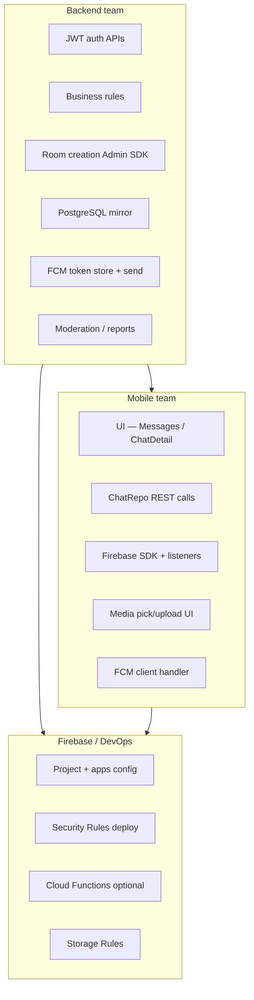
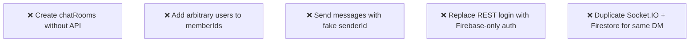

# 05 — Backend vs Mobile Responsibilities

Last updated: 2026-06-06

Clear ownership matrix for each implementation phase. Use this in sprint planning and handoffs between teams.

---

## Responsibility model

---

## Master matrix by phase

| Phase | Backend | Mobile | Firebase / DevOps |
| --- | --- | --- | --- |
| **0 — Alignment** | API contract, UID mapping | Package plan, folder structure | Project setup decision |
| **1 — REST inbox** | Fix `/chat/list`, `/chat/detail` | Wire `ChatRepo` to controllers | — |
| **2 — Bridge** | `firebase-token`, `chat/room`, Admin writes, block check | Firebase init, custom token, `createRoom()` | Rules v1, iOS/Android config |
| **3 — Realtime text** | Optional CF: lastMessage, unread, PG sync | Firestore send/listen, read state | Rules tuning |
| **4 — Media** | Optional moderation | Storage upload, previews | Storage Rules |
| **5 — WhatsApp features** | `chat/report`, block → disable room | Typing, receipts, reply, delete UI | Edit/delete Rules |
| **6 — FCM** | `user/fcm-token`, push sender | FCM register, notification routing | FCM keys in Firebase console |
| **7 — Groups** | Group room API, member management | Group UI | Group Rules |

---

## Phase 1 detail

### Backend

- [ ] Ensure `GET /api/chat/list` returns consistent envelope
- [ ] Ensure `GET /api/chat/detail?target_id=&page=` paginates correctly
- [ ] Include `recipient` object with `id`, `name`, `displayPicture`
- [ ] Document whether `statusCode` is `201` or legacy `success: true`

### Mobile

- [ ] Inject `ChatRepo` into `MessagesTabController`
- [ ] Replace empty inbox list in `MessagesTabView`
- [ ] Load history in `ChatDetailController.onInit`
- [ ] Pass navigation args from `CallView`, Discover, Messages tab
- [ ] Handle loading / empty / error states

---

## Phase 2 detail

### Backend

- [ ] Install Firebase Admin SDK on server
- [ ] Map JWT user → Firebase custom token (UID = `User.id`)
- [ ] Implement `POST /api/chat/firebase-token`
- [ ] Implement `POST /api/chat/room`:
  - Validate JWT
  - Check `Block` both directions
  - Apply match/follow rules if required
  - Compute deterministic 1:1 `roomId`
  - Write `chatRooms/{roomId}` + `userChats/{uid}/rooms/{roomId}` for each member
- [ ] Deploy Firestore Security Rules (no client room create)

### Mobile

- [ ] Add dependencies: `firebase_core`, `firebase_auth`, `cloud_firestore`
- [ ] Configure `google-services.json` / `GoogleService-Info.plist`
- [ ] Create `lib/services/chat/chat_firebase_service.dart`
- [ ] After login success: fetch custom token + sign in
- [ ] On logout: Firebase sign out + clear listeners
- [ ] Extend `ChatRepo` with `createRoom()`, `getFirebaseToken()`
- [ ] Extend `ChatEndpoints` in `api_constants.dart`

### Firebase / DevOps

- [ ] Enable Firestore in Firebase console
- [ ] Register Android/iOS app bundle IDs
- [ ] Deploy initial Security Rules from [03 — Firestore schema](./03-firestore-schema.md)

---

## Phase 3 detail

### Backend

- [ ] (Optional) Cloud Function on message create:
  - Update `chatRooms.lastMessage`
  - Increment `userChats.unreadCount` for recipients
  - Insert row into PostgreSQL `ChatMessage`
- [ ] (Optional) Keep `/chat/detail` synced for pagination

### Mobile

- [ ] Stream: `chatRooms/{roomId}/messages` orderBy `createdAt` desc limit 50
- [ ] Send message: write doc with `clientMessageId`
- [ ] On room open: set `unreadCount = 0`
- [ ] Update `deliveryState` / `status.deliveredAt` on receive
- [ ] Enable Firestore offline persistence
- [ ] Remove mock data from `ChatDetailController`

---

## Phase 4 detail

### Backend

- [ ] Deploy Firebase Storage Rules (member-only paths)
- [ ] (Optional) Webhook/queue for flagged media

### Mobile

- [ ] `ChatMediaService` — upload with progress
- [ ] Image picker / file picker integration (packages already in `pubspec.yaml`)
- [ ] Voice note recording (add package if needed)
- [ ] Bubble UI for image/audio/video types

---

## Phase 5 detail

### Backend

- [ ] `POST /api/chat/report` — store in PostgreSQL
- [ ] On block: mark room inactive or reject new room creation
- [ ] Tighten Security Rules for edit/delete time windows

### Mobile

- [ ] Read receipt UI (ticks)
- [ ] Typing indicator listener + writer
- [ ] Reply long-press → `replyTo`
- [ ] Delete for me / everyone
- [ ] Edit message (15 min)
- [ ] Reaction picker
- [ ] Presence listener on chat header
- [ ] Mute / pin / archive on inbox row

---

## Phase 6 detail

### Backend

- [ ] `POST /api/user/fcm-token` — `{ token, platform }`
- [ ] Store tokens per user (multiple devices)
- [ ] Send FCM via Admin SDK or Cloud Function when message created and recipient offline

### Mobile

- [ ] Add `firebase_messaging`
- [ ] Request notification permission (iOS)
- [ ] Send token to backend after login
- [ ] Handle foreground/background messages
- [ ] Deep link to `Routes.CHAT_DETAIL` with `roomId`

---

## What mobile should NOT do

---

## What backend should NOT do

- Proxy every message through REST (defeats Firestore realtime purpose)
- Allow client-created rooms without block/permission checks
- Use a different ID for Firebase UID vs PostgreSQL `User.id`

---

## Communication checklist (handoff meeting)

| Question | Owner | Answer by |
| --- | --- | --- |
| Firebase project ID? | DevOps | Phase 0 |
| UID = PostgreSQL `User.id`? | Backend | Phase 0 |
| Who can start a chat (anyone / matches / followers)? | Product | Phase 0 |
| API success envelope for new endpoints? | Backend | Phase 0 |
| Cloud Functions: backend team or separate? | DevOps | Phase 2 |
| Push: CF or backend cron? | Backend | Phase 6 |

---

## Next document

→ [06 — API reference](./06-api-reference.md)
