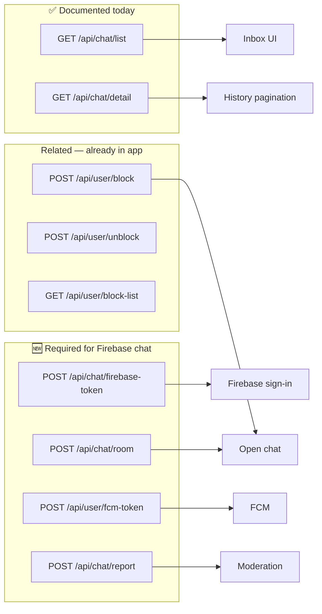
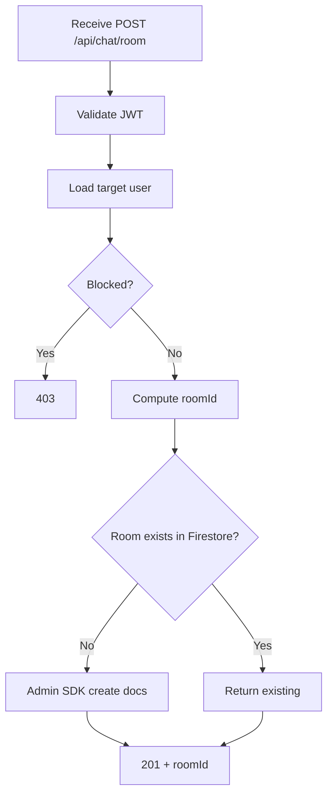
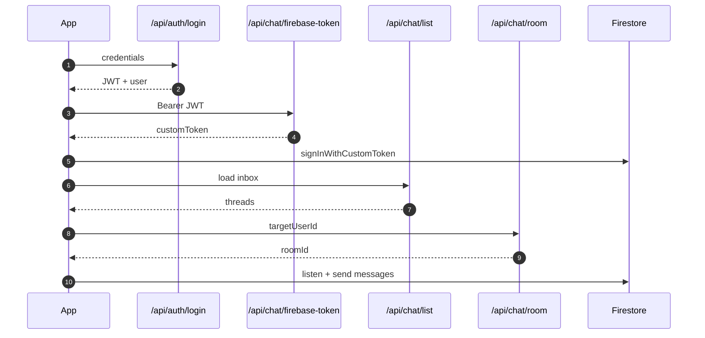

# 06 — API Reference (Chat)

Last updated: 2026-06-06

REST endpoints for chat. **Message send/receive** uses Firestore (Phases 3+), not REST.

Base URL: `https://my-backend-api-960q.onrender.com`

All protected routes:

```
Authorization: Bearer {jwt_token}
Content-Type: application/json
```

---

## Endpoint map



---

## Existing endpoints

### GET /api/chat/list

**Purpose:** Inbox thread list for authenticated user.

**Mobile:** `ChatRepo.getInbox()` → `ChatEndpoints.list`

**Response (from backend handover):**

```json
{
  "success": true,
  "message": "Inbox threads fetched",
  "data": [
    {
      "id": "partner-user-uuid",
      "lastMessage": "Hello there!",
      "lastMessageTime": "2026-05-25T05:12:31.000Z",
      "lastMessageType": "text",
      "unreadCount": 2,
      "recipient": {
        "id": "partner-user-uuid",
        "name": "Jane Doe",
        "displayPicture": "http://localhost:5000/uploads/profiles/jane.png",
        "gender": "female",
        "level": 5
      }
    }
  ]
}
```

**Target envelope (recommended for new work):**

```json
{
  "statusCode": 201,
  "message": "Inbox threads fetched",
  "data": [ "...same array..." ]
}
```

---

### GET /api/chat/detail

**Purpose:** Paginated message history between current user and partner. Backend docs state this also marks messages read.

**Query parameters:**

| Param | Type | Required | Description |
| --- | --- | --- | --- |
| `target_id` | string | Yes | Partner user UUID |
| `page` | number | No | Default `1` |

**Mobile:** `ChatRepo.getConversation(targetId: ...)`

**Example:**

```
GET /api/chat/detail?target_id=partner-uuid&page=1
```

**Response:**

```json
{
  "success": true,
  "message": "Chat history fetched",
  "data": [
    {
      "id": "message-uuid",
      "senderId": "partner-user-uuid",
      "receiverId": "my-user-uuid",
      "content": "Hello there!",
      "type": "text",
      "isRead": true,
      "createdAt": "2026-05-25T05:12:31.000Z"
    }
  ]
}
```

**Note:** After Phase 3, use this for **older pages** when scrolling up; live tail comes from Firestore.

---

## New endpoints (backend to implement)

### POST /api/chat/firebase-token

**Purpose:** Issue Firebase custom token so mobile can access Firestore with `uid = User.id`.

**Phase:** 2

**Request:** No body (user from JWT).

**Response:**

```json
{
  "statusCode": 201,
  "message": "Firebase token issued",
  "data": {
    "firebaseCustomToken": "eyJhbGciOiJSUzI1NiIs...",
    "firebaseUid": "user-uuid-from-jwt"
  }
}
```

**Backend implementation notes:**

- Use Firebase Admin SDK `createCustomToken(uid)`
- `firebaseUid` must match PostgreSQL primary key
- Reject if JWT invalid or user deleted

**Mobile flow:**

```dart
// After AuthSessionHelper saves JWT:
final response = await chatRepo.getFirebaseToken();
await FirebaseAuth.instance.signInWithCustomToken(
  response['data']['firebaseCustomToken'],
);
```

---

### POST /api/chat/room

**Purpose:** Create or return existing 1:1 chat room. Writes Firestore via Admin SDK.

**Phase:** 2

**Request (direct message):**

```json
{
  "type": "direct",
  "targetUserId": "partner-user-uuid"
}
```

**Request (group — Phase 7):**

```json
{
  "type": "group",
  "memberIds": ["uuid-b", "uuid-c"],
  "name": "Agency Hosts",
  "photoUrl": "https://optional-group-photo"
}
```

**Response:**

```json
{
  "statusCode": 201,
  "message": "Chat room ready",
  "data": {
    "roomId": "uuid-a_uuid-b",
    "type": "direct",
    "isNew": true,
    "members": [
      {
        "id": "uuid-a",
        "name": "Me",
        "displayPicture": "/uploads/..."
      },
      {
        "id": "uuid-b",
        "name": "Jane Doe",
        "displayPicture": "/uploads/..."
      }
    ],
    "peer": {
      "id": "uuid-b",
      "name": "Jane Doe",
      "displayPicture": "/uploads/..."
    },
    "firestorePath": "chatRooms/uuid-a_uuid-b"
  }
}
```

**Error cases:**

| HTTP | Body | When |
| --- | --- | --- |
| 403 | User blocked | Either direction in `Block` table |
| 404 | Target not found | Invalid `targetUserId` |
| 422 | Not allowed | Business rule (e.g. not matched) |

**Backend steps:**



---

### POST /api/user/fcm-token

**Purpose:** Register device FCM token for push when new messages arrive.

**Phase:** 6

**Request:**

```json
{
  "token": "fcm-device-token-string",
  "platform": "android"
}
```

`platform`: `"android"` | `"ios"`

**Response:**

```json
{
  "statusCode": 201,
  "message": "FCM token saved",
  "data": {
    "success": true
  }
}
```

---

### POST /api/chat/report

**Purpose:** Report abusive message for moderation.

**Phase:** 5

**Request:**

```json
{
  "roomId": "uuid-a_uuid-b",
  "messageId": "msg_abc123",
  "reason": "spam"
}
```

**Response:**

```json
{
  "statusCode": 201,
  "message": "Report submitted",
  "data": {
    "reportId": "report-uuid"
  }
}
```

---

## Related endpoints (already in mobile repo)

### POST /api/user/block

**Mobile:** `UserRepo.blockUser(targetId: ...)`

```json
{ "target_id": "user-uuid" }
```

### POST /api/user/unblock

```json
{ "target_id": "user-uuid" }
```

### GET /api/user/block-list

**Mobile:** `UserRepo.getBlockList()`

Call before or inside `POST /api/chat/room` on backend — do not rely on mobile-only checks.

---

## Mobile constants (target)

Add to `lib/services/api_constants.dart`:

```dart
class ChatEndpoints {
  ChatEndpoints._();

  static const String list = '/api/chat/list';
  static const String detail = '/api/chat/detail';
  static const String firebaseToken = '/api/chat/firebase-token';
  static const String room = '/api/chat/room';
  static const String report = '/api/chat/report';
}

class UserEndpoints {
  // ... existing ...
  static const String fcmToken = '/api/user/fcm-token';
}
```

---

## Auth endpoints (unchanged — chat depends on these)

| Method | Path | Purpose |
| --- | --- | --- |
| POST | `/api/auth/login` | Primary login → JWT |
| POST | `/api/auth/social` | Google / Facebook |
| POST | `/api/auth/firebase-login` | Phone via Firebase idToken (optional) |
| GET | `/api/user/profile` | Refresh profile for chat header |

Chat Firebase token is **separate** from `/api/auth/firebase-login`. Login stays REST; chat token is issued after session exists.

---

## Sequence: full API usage per session



---

## Back to index

→ [README — Chat documentation](./README.md)
