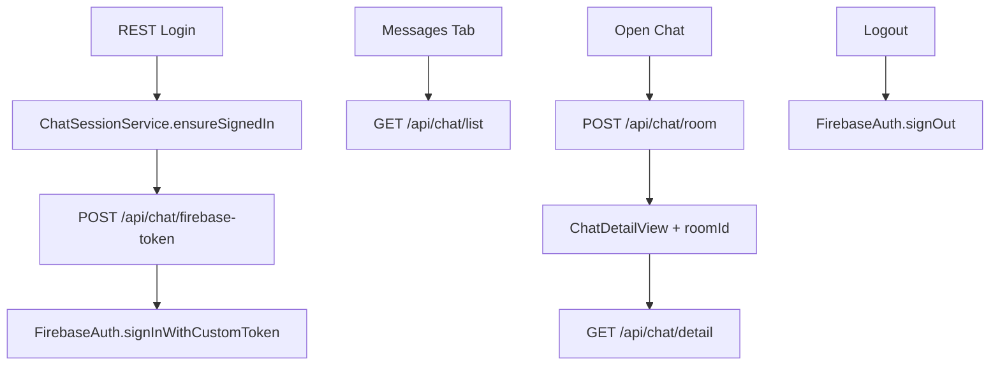

# 07 — Backend API Reference (Mobile Handover)

Last updated: 2026-06-07

Source: backend team `API_Chat_Reference.md`, integrated in Flutter via `ChatRepo`.

**Base URL:** `https://my-backend-api-960q.onrender.com`  
**Auth:** `Authorization: Bearer {jwt}` on all endpoints below.

---

## Response envelope

Backend doc notes both `statusCode: 201` and legacy `1`. Mobile treats **1, 200, 201** as success (`isSocialApiSuccess`).

Error example (no token):

```json
{
  "statusCode": 0,
  "message": "Not authorized, no token",
  "data": null
}
```

---

## Endpoints

| Method | Path | Flutter | Status |
| --- | --- | --- | --- |
| POST | `/api/chat/firebase-token` | `ChatRepo.getFirebaseToken()` | Integrated |
| POST | `/api/chat/room` | `ChatRepo.createRoom()` | Integrated |
| POST | `/api/user/fcm-token` | `ChatRepo.registerFcmToken()` | Repo ready; FCM Phase 6 |
| POST | `/api/chat/send` | `ChatRepo.sendMessage()` | **Backend required — 404 today** |
| GET | `/api/chat/list` | `ChatRepo.getInbox()` | Integrated |
| GET | `/api/chat/detail` | `ChatRepo.getConversation()` | Integrated |

---

## POST /api/chat/room — request body

Backend expects:

```json
{
  "type": "direct",
  "target_id": "partner-uuid"
}
```

Mobile sends both fields (fixed from earlier `target_id`-only payload).

---

## POST /api/chat/send (required — returns 404 today)

**Purpose:** Persist message so history and inbox work after reopen.

**Request:**

```json
{
  "target_id": "partner-user-uuid",
  "content": "Hello",
  "type": "text",
  "room_id": "uuid-a_uuid-b"
}
```

**Response:**

```json
{
  "statusCode": 1,
  "message": "Message sent",
  "data": {
    "id": "message-uuid",
    "senderId": "my-uuid",
    "receiverId": "partner-uuid",
    "content": "Hello",
    "type": "text",
    "createdAt": "2026-06-07T14:06:00.000Z"
  }
}
```

**Backend must also update** `GET /api/chat/list` (`lastMessage`, `lastMessageTime`) when a message is sent.

**Mobile fallback:** Until this endpoint exists, messages are cached on device only (`ChatLocalStore`).

---

## Mobile integration map



Files:

- `lib/repo/chat/chat_repo.dart`
- `lib/services/chat/chat_session_service.dart`
- `lib/repo/chat/chat_navigation_helper.dart`
- `lib/app/user_flow/messages/messages_tab/controllers/messages_tab_controller.dart`
- `lib/app/user_flow/messages/chat_detail/controllers/chat_detail_controller.dart`

---

## Known API gaps / issues (ask backend)

See main README section or report to backend team:

1. **`POST /api/chat/send` missing (404)** — mobile caches locally until backend implements send.
2. Inbox list does not include `roomId` — app calls `POST /api/chat/room` when opening thread.
3. `statusCode: 0` on auth errors — inconsistent with `201` success; document all error codes.
4. No token refresh contract for `firebase-token` when custom token expires.
5. No `DELETE /api/user/fcm-token` on logout.
6. `report.reason` — no enum documented.
7. `GET /api/chat/list` / `detail` — full response schema not in handover doc.

---

→ [README](./README.md)
