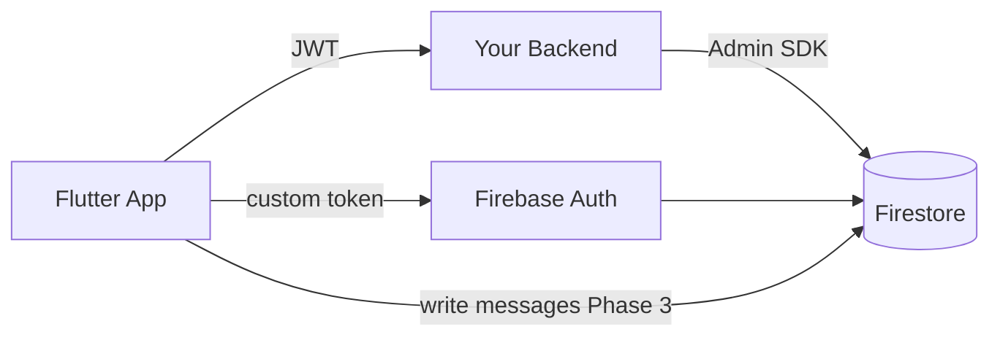
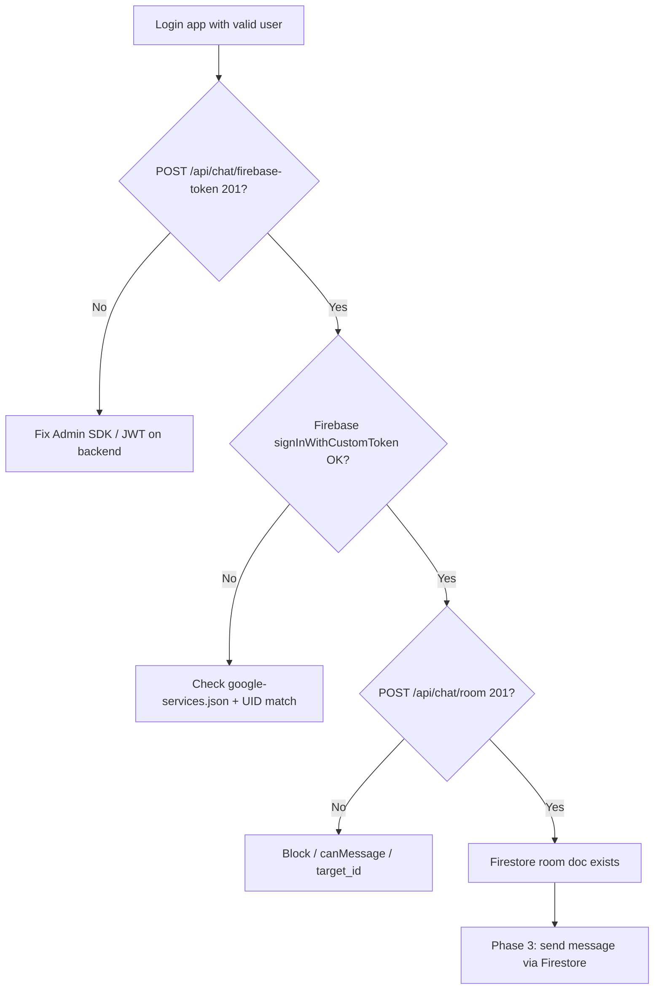

# 08 — Firebase Setup Checklist

Last updated: 2026-06-07

What the **backend**, **DevOps**, and **mobile** teams must configure before realtime Firestore messaging works end-to-end.

---

## Architecture reminder



REST login stays primary. Firebase Auth UID **must equal** PostgreSQL `User.id`.

---

## 1. Firebase Console (DevOps / backend)

**Project in use:** `qobo1live-914ac` (project number `152049582917`)

| Platform | Status (R&D 2026-06-07) | Action |
| --- | --- | --- |
| **Android** | `android/app/google-services.json` present for `com.qobo1live.live` | OK — app uses `lib/firebase/firebase_options.dart` |
| **iOS** | `ios/Runner/GoogleService-Info.plist` **missing** (2026-06-07) | Register iOS app in Console → download plist → run `flutterfire configure` |
| **Mobile Firestore** | `cloud_firestore` + `ChatFirebaseService` | Send/receive on `chatRooms/{roomId}/messages` when Firebase Auth succeeds |

| Step | Action |
| --- | --- |
| 1 | Firebase project **`qobo1live-914ac`** (same as Google Sign-In Web client) |
| 2 | Android app **`com.qobo1live.live`** — already registered |
| 3 | **Add iOS app** `com.qobo1live.live` in Firebase Console if testing on iPhone/simulator |
| 4 | Download **`GoogleService-Info.plist`** → `ios/Runner/` |
| 5 | Run `dart pub global activate flutterfire_cli` then `flutterfire configure --project=qobo1live-914ac` to refresh `firebase_options.dart` |
| 6 | Enable **Firestore**, **Authentication (Custom)**, **Storage**, **FCM** as needed |

Files are gitignored in this repo (`**/google-services.json`). Each developer and CI must receive them securely.

---

## 2. Backend (Firebase Admin SDK)

| Step | Action |
| --- | --- |
| 1 | Add Firebase Admin SDK to Node server |
| 2 | Store service account JSON securely (env var / secret manager — **never commit**) |
| 3 | Implement `POST /api/chat/firebase-token` → `admin.auth().createCustomToken(userId)` |
| 4 | Implement `POST /api/chat/room` → write Firestore docs via Admin SDK |
| 5 | Deploy **Firestore Security Rules** (see [03 — Firestore schema](./03-firestore-schema.md)) |
| 6 | (Phase 3+) Cloud Function: on message create → update `lastMessage`, FCM |
| 7 | (Phase 4+) Storage Rules for `chatRooms/{roomId}/messages/*` |

### Firestore paths backend must create on `POST /api/chat/room`

```
chatRooms/{roomId}
userChats/{userIdA}/rooms/{roomId}
userChats/{userIdB}/rooms/{roomId}
```

---

## 3. Mobile (Flutter) — already prepared

| Item | Status |
| --- | --- |
| `firebase_core`, `firebase_auth`, `cloud_firestore` in `pubspec.yaml` | Added |
| `ChatFirebaseService` + Firestore in `ChatDetailController` | Added (Phase 3) |
| `lib/firebase/firebase_options.dart` | Added (Android configured; iOS pending plist) |
| `FirebaseBootstrap.tryInitialize()` in `main.dart` | Added |
| `ChatSessionService` | Runs only when Firebase initialized |
| Android `google-services.json` | Present locally (gitignored) |
| iOS `GoogleService-Info.plist` | **Missing — required for iOS/simulator** |

---

## 4. Security Rules (backend deploys)

Minimum rules before mobile writes messages:

- Clients **cannot** create `chatRooms` documents
- Only `memberIds` can read/write messages in that room
- `senderId` on create must equal `request.auth.uid`

Full sketch: [03 — Firestore schema](./03-firestore-schema.md#security-rules-reference-sketch).

---

## 5. Verification checklist



| Test | Expected |
| --- | --- |
| Login → open Messages | No crash; `firebase-token` called silently |
| Open chat with mutual follow | `room` returns `roomId`, navigates to detail |
| `GET /api/chat/list` | Threads render |
| `GET /api/chat/detail` | History loads in `ChatDetailView` |
| Logout | Firebase signed out |

---

## 6. What to request from backend team today

Send them this list:

1. **`google-services.json`** and **`GoogleService-Info.plist`** for `com.qobo1live.live`
2. Confirm **`firebaseUid` = PostgreSQL user UUID** on every custom token
3. Confirm **`POST /api/chat/room`** accepts `{ "type": "direct", "target_id": "..." }`
4. Share deployed **Firestore Security Rules**
5. Confirm **Firestore indexes** if using compound queries (e.g. `messages` by `createdAt`)
6. Document all **error `statusCode`** values (currently `0` for unauthorized)

---

→ [07 — Backend API reference](./07-backend-api-reference.md)
