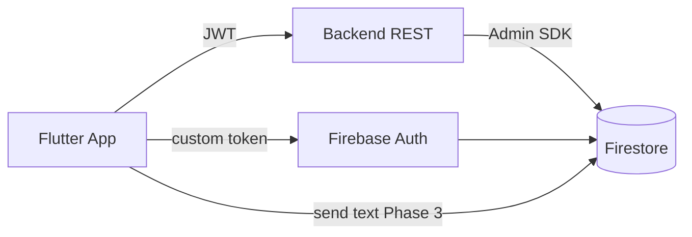
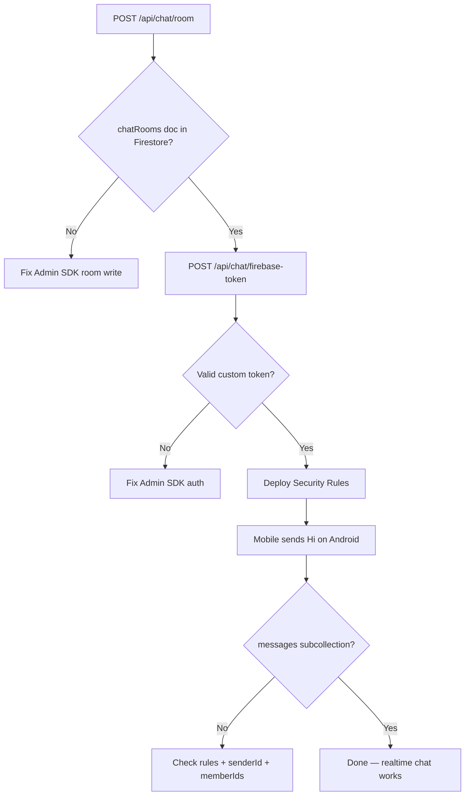

# 09 — Backend Action Items: Chat API & Firestore Blockers

**To:** Backend team  
**From:** Mobile team  
**Date:** 2026-06-07  
**Project:** Qobo One Live  
**Base URL:** `https://my-backend-api-960q.onrender.com`  
**Firebase project:** `qobo1live-914ac`

---

## Summary

Mobile chat UI is integrated. **Messages do not appear in Firestore** because of backend and Firebase configuration gaps — not because the Flutter screens are missing.

**Observed during testing (2026-06-07):**

| Endpoint | Result | Impact |
| --- | --- | --- |
| `POST /api/chat/room` | ✅ `200` / `statusCode: 1` | Room opens in app |
| `POST /api/chat/send` | ❌ **404** `Cannot POST /api/chat/send` | No server-side message persist |
| Firestore Console | ❌ **Empty** (no `chatRooms` collection) | Room API returns `firestorePath` but docs not written |
| Firestore Security Rules | ❌ `allow read, write: if false` | Blocks all client writes even when app is ready |

---

## Architecture (agreed)



- **REST:** login, permissions, room creation, inbox bootstrap, block/report  
- **Firestore:** realtime messages (primary send/receive path on mobile)  
- **Firebase Auth UID** must equal PostgreSQL `User.id` (UUID string)

Mobile does **not** create `chatRooms` documents — backend Admin SDK only.

---

## Blocker 1 — `POST /api/chat/room` must write Firestore documents

### Current behaviour (verified)

**Request:**

```http
POST /api/chat/room
Authorization: Bearer {jwt}
Content-Type: application/json

{
  "type": "direct",
  "target_id": "idc2210865"
}
```

**Response (success):**

```json
{
  "statusCode": 1,
  "message": "Chat room ready",
  "data": {
    "roomId": "d72d18a2-1489-4781-b42e-7f4b9c371921_idc2210865",
    "type": "direct",
    "isNew": true,
    "members": [
      {
        "id": "d72d18a2-1489-4781-b42e-7f4b9c371921",
        "name": "Parth",
        "displayPicture": "http://my-backend-api-960q.onrender.com/default_dp.png"
      },
      {
        "id": "idc2210865",
        "name": "New Host 6",
        "displayPicture": "/uploads/host_real_photo-1780748882753-149243517.jpg"
      }
    ],
    "peer": {
      "id": "idc2210865",
      "name": "New Host 6",
      "displayPicture": "/uploads/host_real_photo-1780748882753-149243517.jpg"
    },
    "firestorePath": "chatRooms/d72d18a2-1489-4781-b42e-7f4b9c371921_idc2210865"
  }
}
```

**Problem:** Firebase Console → Firestore → **Data tab is empty** after this call.  
Returning `firestorePath` in JSON is not enough — **Admin SDK must create the documents**.

### Required Admin SDK writes on room create

```
chatRooms/{roomId}
userChats/{userIdA}/rooms/{roomId}
userChats/{userIdB}/rooms/{roomId}
```

**Minimum `chatRooms/{roomId}` document:**

```json
{
  "roomId": "d72d18a2-1489-4781-b42e-7f4b9c371921_idc2210865",
  "type": "direct",
  "createdAt": "2026-06-07T15:00:00.000Z",
  "createdBy": "d72d18a2-1489-4781-b42e-7f4b9c371921",
  "updatedAt": "2026-06-07T15:00:00.000Z",
  "memberIds": [
    "d72d18a2-1489-4781-b42e-7f4b9c371921",
    "idc2210865"
  ],
  "memberCount": 2,
  "lastMessage": null,
  "isActive": true
}
```

**Minimum `userChats/{userId}/rooms/{roomId}` per member:**

```json
{
  "roomId": "d72d18a2-1489-4781-b42e-7f4b9c371921_idc2210865",
  "type": "direct",
  "peerId": "idc2210865",
  "title": "New Host 6",
  "photoUrl": "/uploads/host_real_photo-1780748882753-149243517.jpg",
  "lastMessagePreview": "",
  "lastMessageAt": null,
  "unreadCount": 0,
  "updatedAt": "2026-06-07T15:00:00.000Z"
}
```

(`peerId` / `title` / `photoUrl` should reflect the **other** user for each row.)

### Acceptance test

1. Call `POST /api/chat/room` with valid JWT.  
2. Open Firebase Console → Firestore → Data.  
3. **Must see** `chatRooms` collection with document `{roomId}`.  
4. **Must see** `userChats/{userA}/rooms/{roomId}` and `userChats/{userB}/rooms/{roomId}`.

---

## Blocker 2 — `POST /api/chat/firebase-token` must work

Mobile calls this after REST login to sign into Firebase before Firestore read/write.

### Request

```http
POST /api/chat/firebase-token
Authorization: Bearer {jwt}
```

### Required response

```json
{
  "statusCode": 1,
  "message": "Firebase token issued",
  "data": {
    "firebaseCustomToken": "eyJhbGciOiJSUzI1NiIs...",
    "firebaseUid": "d72d18a2-1489-4781-b42e-7f4b9c371921"
  }
}
```

### Backend implementation

```javascript
// Node.js example
const customToken = await admin.auth().createCustomToken(userId);
// userId MUST be PostgreSQL User.id — same value mobile uses as senderId
```

### Requirements

| Rule | Detail |
| --- | --- |
| `firebaseUid` | Must equal JWT user's PostgreSQL UUID |
| Custom token | Created via Firebase Admin SDK with service account for `qobo1live-914ac` |
| Service account | Stored in env / secret manager — never committed to git |

### Acceptance test

1. Login → get JWT.  
2. `POST /api/chat/firebase-token` with Bearer token → `statusCode: 1` + non-empty `firebaseCustomToken`.  
3. Mobile log should show: `ChatSessionService: Firebase signed in`.

---

## Blocker 3 — `POST /api/chat/send` returns 404

### Current behaviour (verified)

**Request:**

```http
POST /api/chat/send
Authorization: Bearer {jwt}
Content-Type: application/json

{
  "target_id": "idc2210865",
  "content": "Hi",
  "type": "text",
  "room_id": "d72d18a2-1489-4781-b42e-7f4b9c371921_idc2210865"
}
```

**Response:**

```html
Cannot POST /api/chat/send
```

HTTP **404** — route not registered on server.

### Mobile behaviour

Send order in app:

1. **Firestore** (if Firebase initialized + user signed in)  
2. **`POST /api/chat/send`** (fallback)  
3. **Local device cache** (last resort)

With Firestore blocked and send 404, messages **only exist on one device** — not in Firestore, not for the other user.

### Backend options (pick one)

| Option | Backend work | When to use |
| --- | --- | --- |
| **A — Firestore-only (preferred)** | Fix Blockers 1–2 + deploy Security Rules. Mobile writes messages to Firestore. | Realtime chat, lower API load |
| **B — REST send fallback** | Implement `POST /api/chat/send` + update inbox/detail APIs | iOS without Firebase, offline bootstrap |

### If implementing Option B — suggested contract

**Request:**

```json
{
  "target_id": "partner-uuid",
  "content": "Hello",
  "type": "text",
  "room_id": "uuid-a_uuid-b"
}
```

**Response:**

```json
{
  "statusCode": 1,
  "message": "Message sent",
  "data": {
    "id": "message-uuid",
    "senderId": "my-uuid",
    "receiverId": "partner-uuid",
    "content": "Hello",
    "type": "text",
    "createdAt": "2026-06-07T15:06:00.000Z"
  }
}
```

**Also required when send succeeds:**

- Update `GET /api/chat/list` row (`lastMessage`, `lastMessageTime`, `unreadCount` for receiver)  
- Message visible in `GET /api/chat/detail?target_id=...`  
- Optionally mirror to Firestore `chatRooms/{roomId}/messages/{messageId}` for realtime

---

## Blocker 4 — Firestore Security Rules (backend deploys)

Current production rules block everything:

```javascript
allow read, write: if false;
```

Mobile cannot write messages until rules allow authenticated members.

### Minimum production rules (reference)

Full sketch: [03 — Firestore schema](./03-firestore-schema.md#security-rules-reference-sketch)

```javascript
rules_version = '2';
service cloud.firestore {
  match /databases/{database}/documents {

    function isMember(roomId) {
      return request.auth != null
        && request.auth.uid in get(/databases/$(database)/documents/chatRooms/$(roomId)).data.memberIds;
    }

    match /chatRooms/{roomId} {
      allow read: if isMember(roomId);
      allow create, update: if false; // Admin SDK only

      match /messages/{messageId} {
        allow read: if isMember(roomId);
        allow create: if isMember(roomId)
          && request.resource.data.senderId == request.auth.uid;
        allow update: if isMember(roomId);
      }
    }

    match /userChats/{userId}/rooms/{roomId} {
      allow read, update: if request.auth.uid == userId;
      allow create: if false; // Admin SDK only
    }
  }
}
```

**Note:** `isMember()` requires `chatRooms/{roomId}` to exist (Blocker 1). Without that document, all message writes fail.

### Temporary dev rules (Console only — not production)

```javascript
allow read, write: if request.auth != null;
```

---

## Blocker 5 — Firebase Admin SDK on server

Backend must configure Admin SDK for project **`qobo1live-914ac`**.

| Step | Action |
| --- | --- |
| 1 | Firebase Console → Project settings → Service accounts → **Generate new private key** |
| 2 | Store JSON in server secrets (Render env var, etc.) |
| 3 | Initialize `firebase-admin` in Node server |
| 4 | Use Admin SDK for: custom tokens, `chatRooms` create, optional Cloud Function on new message |

Without Admin SDK, Blockers 1 and 2 cannot be fixed.

---

## Endpoints — full status for mobile

| Method | Path | Mobile status | Backend action |
| --- | --- | --- | --- |
| POST | `/api/chat/room` | ✅ Integrated | **Must write Firestore docs** (Blocker 1) |
| POST | `/api/chat/firebase-token` | ✅ Integrated | **Verify returns valid custom token** (Blocker 2) |
| POST | `/api/chat/send` | ✅ Integrated (fallback) | **404 — implement or confirm Firestore-only** (Blocker 3) |
| GET | `/api/chat/list` | ✅ Integrated | Should reflect last message after send |
| GET | `/api/chat/detail` | ✅ Integrated | History bootstrap; optional if Firestore is source of truth |
| POST | `/api/user/fcm-token` | Repo ready | Phase 6 — push notifications (not blocking chat UI) |
| POST | `/api/chat/report` | ✅ Integrated | — |

**Auth header:** `Authorization: Bearer {jwt}` on all endpoints above.

**Room request body (mobile sends):**

```json
{
  "type": "direct",
  "target_id": "partner-uuid"
}
```

---

## Message document (mobile writes to Firestore when unblocked)

Path: `chatRooms/{roomId}/messages/{messageId}`

```json
{
  "messageId": "auto-doc-id",
  "roomId": "d72d18a2-1489-4781-b42e-7f4b9c371921_idc2210865",
  "senderId": "d72d18a2-1489-4781-b42e-7f4b9c371921",
  "type": "text",
  "content": { "text": "Hi" },
  "deliveryState": "sent",
  "status": {},
  "createdAt": "<serverTimestamp>",
  "clientCreatedAt": "<serverTimestamp>",
  "clientMessageId": "<uuid-for-dedupe>"
}
```

Optional Cloud Function (later): on message create → update `chatRooms.lastMessage`, increment `userChats` unread, send FCM.

---

## End-to-end verification checklist

Backend team can use this after fixes:



| # | Test | Expected |
| --- | --- | --- |
| 1 | `POST /api/chat/room` | Firestore shows `chatRooms/{roomId}` |
| 2 | `POST /api/chat/firebase-token` | `statusCode: 1`, token non-empty |
| 3 | Firestore Rules published | Not `if false` for members |
| 4 | Mobile send on Android | `chatRooms/{roomId}/messages/{id}` appears |
| 5 | Second user opens chat | Message visible in realtime |
| 6 | `POST /api/chat/send` | Either 201 **or** documented as intentionally unused |

---

## Additional gaps (non-blocking but please document)

1. **`GET /api/chat/list`** — response schema not fully documented; inbox does not always include `roomId` (mobile calls `room` again when opening thread).  
2. **`GET /api/chat/detail`** — full message schema not in handover doc.  
3. **Error codes** — auth failures use `statusCode: 0`; success uses `1` or `201` — please publish a single enum.  
4. **`firebase-token` refresh** — no contract when custom token expires mid-session.  
5. **`DELETE /api/user/fcm-token`** — not implemented for logout (Phase 6).  
6. **`POST /api/chat/report`** — `reason` enum not documented.

---

## Mobile side (for reference — no backend change needed)

| Item | Status |
| --- | --- |
| `ChatRepo` — all chat REST calls | Done |
| `ChatFirebaseService` — Firestore send/listen | Done |
| `ChatSessionService` — custom token sign-in | Done |
| `ChatDetailController` — Firestore first, REST/local fallback | Done |
| Android `google-services.json` | Configured |
| iOS `GoogleService-Info.plist` | Pending — Firestore skipped on iOS until added |

---

## Priority order for backend

1. **Firebase Admin SDK** on server (service account for `qobo1live-914ac`)  
2. **`POST /api/chat/room`** → write `chatRooms` + `userChats` in Firestore  
3. **`POST /api/chat/firebase-token`** → verify working with real JWT  
4. **Deploy Firestore Security Rules** (member-based)  
5. **`POST /api/chat/send`** → implement **or** confirm Firestore-only and document  
6. (Later) Cloud Function: `lastMessage`, unread, FCM  

---

## Related docs in this repo

- [03 — Firestore schema](./03-firestore-schema.md)  
- [06 — API reference](./06-api-reference.md)  
- [07 — Backend API reference (mobile integration)](./07-backend-api-reference.md)  
- [08 — Firebase setup checklist](./08-firebase-setup-checklist.md)  

---

**Questions:** Reply with deployed Security Rules JSON and a screenshot of Firestore Data after `POST /api/chat/room` so mobile can re-test on Android.
