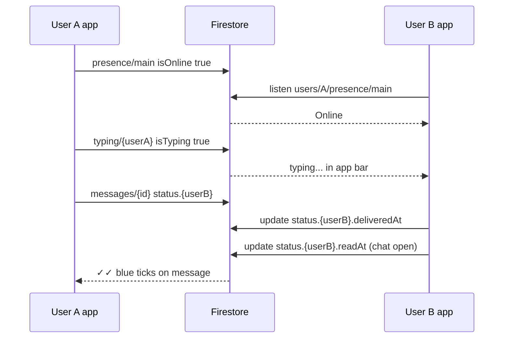

# 11 — Phase 5: Typing, Online/Offline, Read Receipts

Last updated: 2026-06-08

WhatsApp-style signals for 1-on-1 chat. **All realtime via Firestore** — no new REST endpoints required for core behaviour.

---

## Feature summary

| Feature | Firestore path | Who writes |
| --- | --- | --- |
| **Typing...** | `chatRooms/{roomId}/typing/{userId}` | Mobile (both users) |
| **Online / Last seen** | `users/{userId}/presence/main` | Mobile (each user) |
| **Read receipts** | `chatRooms/{roomId}/messages/{id}.status.{userId}` | Mobile (recipient) |

---

## Architecture



---

## 1. Typing indicator

### Document: `chatRooms/{roomId}/typing/{userId}`

```json
{
  "userId": "uuid-a",
  "isTyping": true,
  "updatedAt": "<serverTimestamp>"
}
```

### Mobile behaviour (implemented)

- On text field change → debounce 300ms → `setTyping(true)`
- Auto-clear after 4s idle or on send → delete typing doc
- Listen `typing` subcollection → show "typing..." if peer doc fresh (&lt; 5s)

### Security Rules (backend must add)

```javascript
match /chatRooms/{roomId}/typing/{userId} {
  allow read: if isMember(roomId);
  allow write: if request.auth.uid == userId && isMember(roomId);
}
```

**Note:** Current deployed rules from backend may **not** include `typing` — extend and publish.

---

## 2. Online / offline / last seen

### Document: `users/{userId}/presence/main`

```json
{
  "isOnline": true,
  "lastSeenAt": "2026-06-08T10:00:00.000Z",
  "platform": "android"
}
```

### Mobile behaviour (implemented)

| Event | Action |
| --- | --- |
| Open chat + Firebase signed in | `isOnline: true` |
| Leave chat screen | `isOnline: false`, `lastSeenAt` updated |
| Peer listener | App bar: "Online" / "Last seen today at 14:30" |

### App-wide presence (optional later)

Set online on login / bottom-nav foreground; offline on logout — requires `ChatPresenceService` at app level.

### Security Rules (backend must add)

```javascript
match /users/{userId}/presence/{doc} {
  allow read: if request.auth != null;
  allow write: if request.auth.uid == userId;
}
```

---

## 3. Read receipts (✓ / ✓✓ / blue ✓✓)

### Message field: `status.{recipientUserId}`

```json
{
  "status": {
    "idc2210865": {
      "deliveredAt": "2026-06-08T10:01:00.000Z",
      "readAt": "2026-06-08T10:02:00.000Z"
    }
  }
}
```

### Tick mapping (outgoing messages)

| UI | Condition |
| --- | --- |
| ✓ (single grey) | `deliveredAt` and `readAt` both null |
| ✓✓ (double grey) | `deliveredAt` set, `readAt` null |
| ✓✓ (double blue) | `readAt` set |

### Mobile behaviour (implemented)

- **Sender** creates message with `status: { [targetId]: { deliveredAt: null, readAt: null } }`
- **Recipient** on message snapshot while chat open:
  - Sets `status.{myUserId}.deliveredAt` and `readAt` (batch update)
- **Sender** UI reads `status[targetId]` from live message stream

### Security Rules

Existing rule allows member updates:

```javascript
match /messages/{messageId} {
  allow update: if isMember(roomId);
}
```

Tighten in production: only recipient may write their own `status.{uid}` keys.

---

## Backend action items

| # | Task | Required? |
| --- | --- | --- |
| 1 | Extend Firestore Security Rules with `typing` + `presence` blocks | **Yes** |
| 2 | Firebase Admin SDK + `firebase-token` working | **Yes** (prerequisite) |
| 3 | `chatRooms/{roomId}` with `memberIds` on room create | **Yes** (for `isMember`) |
| 4 | New REST APIs for typing/presence/read | **No** |
| 5 | Cloud Function to sync read state to PostgreSQL | Optional |

### Updated rules file to publish

Merge into existing `firestore.rules`:

```javascript
rules_version = '2';
service cloud.firestore {
  match /databases/{database}/documents {

    function isMember(roomId) {
      return request.auth != null
        && request.auth.uid in get(/databases/$(database)/documents/chatRooms/$(roomId)).data.memberIds;
    }

    match /chatRooms/{roomId} {
      allow read: if isMember(roomId);
      allow create, update: if false;

      match /messages/{messageId} {
        allow read: if isMember(roomId);
        allow create: if isMember(roomId)
          && request.resource.data.senderId == request.auth.uid;
        allow update: if isMember(roomId);
      }

      match /typing/{userId} {
        allow read: if isMember(roomId);
        allow write: if request.auth.uid == userId && isMember(roomId);
      }
    }

    match /userChats/{userId}/rooms/{roomId} {
      allow read, update: if request.auth.uid == userId;
      allow create: if false;
    }

    match /users/{userId}/presence/{doc} {
      allow read: if request.auth != null;
      allow write: if request.auth.uid == userId;
    }
  }
}
```

---

## Mobile files (implemented)

| File | Role |
| --- | --- |
| `lib/services/chat/chat_firebase_service.dart` | typing, presence, ack/read, send with status |
| `lib/app/user_flow/messages/chat_detail/controllers/chat_detail_controller.dart` | listeners, debounce, state |
| `lib/app/user_flow/messages/chat_detail/views/chat_detail_view.dart` | subtitle, typing banner, tick icons |

---

## Testing checklist

| Test | Expected |
| --- | --- |
| User A opens chat | `users/{A}/presence/main` → `isOnline: true` |
| User B views chat with A | App bar shows "Online" or "Last seen ..." |
| User A types | User B sees "typing..." within ~1s |
| User A sends message | User B sees message; A sees ✓ |
| User B has chat open | A's message gets ✓✓ blue when B's client acks read |
| User A leaves chat | `isOnline: false` on A's presence doc |

---

## Prerequisites (still blocking from earlier testing)

Features only work when:

1. `POST /api/chat/firebase-token` succeeds (Admin SDK initialized, project `qobo1live-914ac`)
2. `POST /api/chat/room` creates `chatRooms/{roomId}` with `memberIds`
3. Extended Security Rules published

Without these, mobile falls back to local-only chat with no typing/presence/ticks.

---

→ [03 — Firestore schema](./03-firestore-schema.md)  
→ [09 — Backend blockers](./09-backend-action-items-chat-blockers.md)
