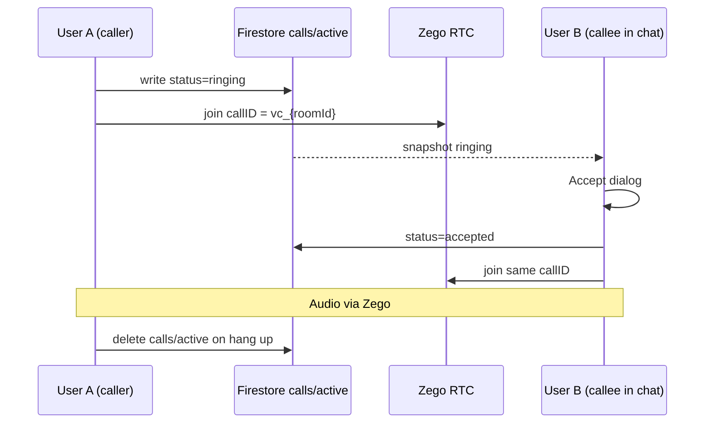

# 13 — ZegoCloud Voice Call Setup (Chat)

**Last updated:** 2026-06-11  
**Mobile package:** `zego_uikit_prebuilt_call`  
**Call project App ID:** `1417441758` (`ZegoConfig.callAppId`)  
**Live streaming App ID:** `1291066184` (`ZegoConfig.liveAppId`) — separate Zego console project

---

## What we need from ZegoCloud (checklist)

Share this with whoever manages the [ZEGOCLOUD Console](https://console.zegocloud.com).

| # | Item | Where in console | Status / notes |
| --- | --- | --- | --- |
| 1 | **App ID + App Sign** | Project → Basic Information | **Call project:** `1417441758` + AppSign in `ZegoConfig.callAppId` / `callAppSign` |
| 2 | **Voice & Video Call** product enabled | Project → All products → **Call Kit** | Must be **activated** on AppID **1417441758** (not the live streaming project) |
| 3 | **Bundle ID registered** | Project → App settings → Native platforms | `com.qobo1live.live` on **Android + iOS** (same as live) |
| 4 | **Microphone permission** | Mobile project (not console) | Android `RECORD_AUDIO` ✅ · iOS `NSMicrophoneUsageDescription` ✅ |
| 5 | **Firestore rules** | Firebase Console → Rules | Publish `docs/chat/firestore.rules` — includes `chatRooms/{roomId}/calls/{callDoc}` |
| 6 | **Optional: Token auth** | Console → Server-assisted authentication | Only if moving off App Sign in production (`GET /api/room/zego-token` exists) |
| 7 | **Phase 2: Offline ring** | Console → ZIM + FCM + Call Kit offline push | Needs **In-app Chat (ZIM)** + FCM `resourceID` — not required for in-app ring today |

### Not required for v1 (in-chat audio call)

- Same AppID as live streaming — we use a **dedicated Call Kit project** (`1417441758`)
- ZIM / Signaling plugin — v1 uses **Firestore ring** + direct `ZegoUIKitPrebuiltCall` join
- Video call — UI shows “coming soon”; voice is implemented first

---

## How mobile chat voice call works (v1)



| Piece | Technology |
| --- | --- |
| Media (audio) | **ZegoUIKitPrebuiltCall** — `oneOnOneVoiceCall()` |
| Call channel ID | `vc_{chatRoomId}` — stable per 1:1 thread |
| Ring / accept | **Firestore** `chatRooms/{roomId}/calls/active` |
| User identity | PostgreSQL user UUID → `ZegoLiveIdUtils.sanitizeUserId()` |

---

## Firestore path (publish rules)

```
chatRooms/{roomId}/calls/active
```

Example document:

```json
{
  "callId": "vc_uuid-a_uuid-b",
  "roomId": "uuid-a_uuid-b",
  "callerId": "uuid-a",
  "callerName": "Parth",
  "type": "voice",
  "status": "ringing",
  "startedAt": "<Timestamp>"
}
```

---

## Mobile entry points

| UI | Action |
| --- | --- |
| Chat detail app bar — **phone icon** | Start voice call |
| Chat detail — callee in same screen | Incoming **Accept / Decline** dialog |
| Chat detail — **video icon** | Placeholder (“coming soon”) |

---

## Test plan (2 devices)

1. User A opens chat with User B → tap **phone**
2. Grant microphone on both devices
3. User B (chat open) sees incoming dialog → **Accept**
4. Both hear audio; hang up clears Firestore `calls/active`
5. Firebase Console → `chatRooms/{roomId}/calls/active` appears then deletes on end

### Known v1 limits

- Callee must have **chat screen open** (or app foreground on that chat) to see ring — no system push yet
- Both users must be signed into **Firebase** (`POST /api/chat/firebase-token`)
- **Publish updated Firestore rules** or call signaling gets `permission-denied`

---

## Phase 2 — WhatsApp-style ring anywhere (optional)

Ask Zego to enable + mobile to integrate:

1. **ZIM (In-app Chat)** on AppID `1291066184`
2. `zego_uikit_signaling_plugin` + `ZegoUIKitPrebuiltCallInvitationService`
3. FCM + Zego offline push `resourceID` in console
4. Backend: `POST /api/chat/call/invite` optional audit log

---

## Backend optional API (future)

| API | Purpose |
| --- | --- |
| `POST /api/chat/call/start` | Log call attempt, return `callId` |
| `POST /api/chat/call/end` | CDR / duration billing |
| `GET /api/room/zego-token?room_id=` | Token mode instead of App Sign |

---

## Code map

| File | Role |
| --- | --- |
| `lib/constants/zego_config.dart` | `liveAppId` / `liveAppSign` (Go Live) · `callAppId` / `callAppSign` (chat calls) |
| `lib/utils/zego_call_id_utils.dart` | `callID` from `roomId` |
| `lib/services/chat/chat_voice_call_service.dart` | Firestore ring/accept/end |
| `lib/app/user_flow/messages/chat_voice_call/` | Zego call UI |
| `lib/app/user_flow/messages/chat_detail/` | Phone button + incoming dialog |
