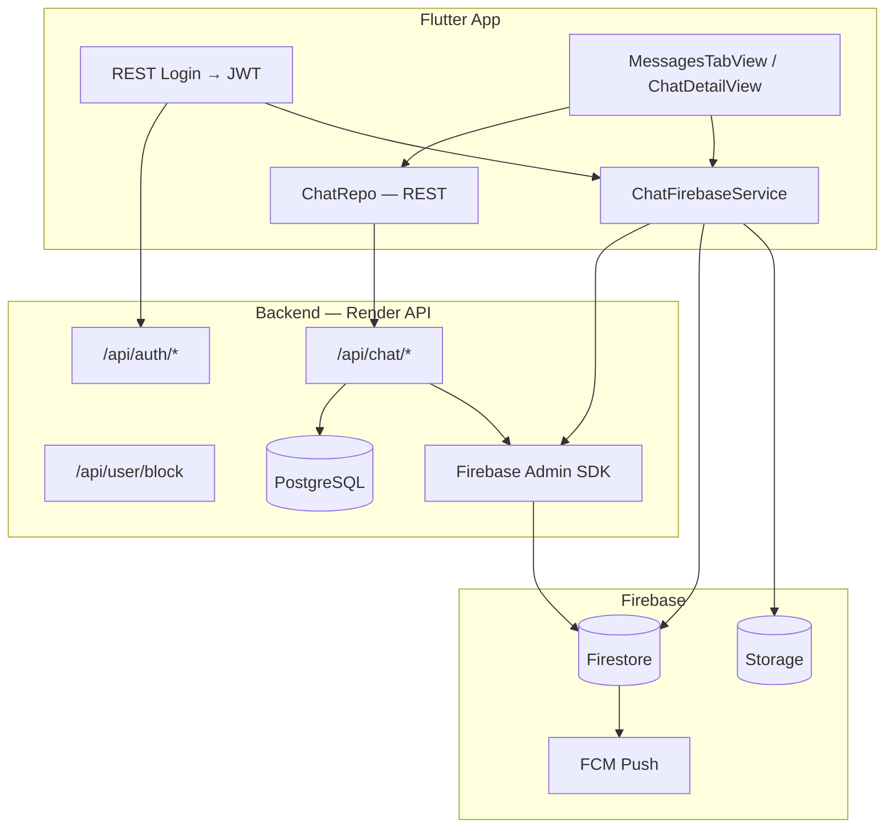

# Chat & Messaging — Documentation Index

Last updated: 2026-06-06

This folder contains the architecture, schema, and implementation plan for **1-on-1 and group chat** in Qobo One Live. Chat uses a **hybrid model**: your existing **REST + JWT login** for auth and permissions, and **Firebase (Firestore + Storage + FCM)** for realtime messages and media.

---

## Quick links

| Document | Purpose |
| --- | --- |
| [01 — Project analysis](./01-project-analysis.md) | What exists today in Flutter and backend |
| [02 — Architecture](./02-architecture.md) | Firebase + REST hybrid, flows, and diagrams |
| [03 — Firestore schema](./03-firestore-schema.md) | Collections, documents, WhatsApp-style fields |
| [04 — Phase-wise plan](./04-phase-wise-plan.md) | Rollout phases 0–7 with exit criteria |
| [05 — Backend vs mobile](./05-backend-vs-mobile.md) | Who builds what, per phase |
| [06 — API reference](./06-api-reference.md) | REST endpoints (existing + new) |
| [07 — Backend handover](./07-backend-api-reference.md) | Backend team's API doc + mobile integration status |
| [08 — Firebase setup](./08-firebase-setup-checklist.md) | Console, Admin SDK, config files checklist |
| [09 — Backend blockers (share with API team)](./09-backend-action-items-chat-blockers.md) | **Action items from live testing — Firestore empty, send 404** |
| [10 — Firestore inbox list handover](./10-backend-firestore-inbox-list-handover.md) | **List chats by roomId for logged-in user — backend spec** |
| [11 — Typing, presence, read receipts](./11-phase5-typing-presence-read-receipts.md) | **Phase 5 WhatsApp signals — Firestore + mobile** |

---

## Architecture at a glance

---

## Core decisions

| Topic | Decision |
| --- | --- |
| **Login** | Keep REST JWT (`Authorization: Bearer`). Do not replace app login with Firebase Auth as primary. |
| **Realtime DMs** | **Firestore** (not Socket.IO `send_private_message` for 1:1 chat). |
| **Live streaming chat** | Keep **Socket.IO / Zego** for in-room comments only. |
| **Create chat room** | **Backend REST** (`POST /api/chat/room`) using Firebase Admin SDK. |
| **Send messages** | **Mobile → Firestore** (with Security Rules). |
| **Inbox on app open** | **REST** `GET /api/chat/list` + optional Firestore listener for live updates. |
| **User ID** | Backend PostgreSQL `User.id` = Firebase Auth UID (via custom token). |

---

## Related code in this repo

| Area | Path |
| --- | --- |
| Chat REST repo | `lib/repo/chat/chat_repo.dart` |
| Chat endpoints | `lib/services/api_constants.dart` → `ChatEndpoints` |
| Messages tab UI | `lib/app/user_flow/messages/messages_tab/` |
| Chat detail UI | `lib/app/user_flow/messages/chat_detail/` |
| Session / user id | `lib/services/user_session_controller.dart` |
| Block APIs | `lib/repo/user/user_repo.dart` |
| Backend handover (chat section) | `docs/developer_api_handover.md` → Category B |
| Implementation tracker | `docs/IMPLEMENTATION_TRACKER.md` → MSG-01, MSG-02 |

---

## Suggested reading order

1. **Product / PM** → README (this file) + [04 — Phase-wise plan](./04-phase-wise-plan.md)
2. **Backend team** → [02 — Architecture](./02-architecture.md) + [06 — API reference](./06-api-reference.md) + [03 — Firestore schema](./03-firestore-schema.md)
3. **Mobile team** → [01 — Project analysis](./01-project-analysis.md) + [05 — Backend vs mobile](./05-backend-vs-mobile.md) + [04 — Phase-wise plan](./04-phase-wise-plan.md)

---

## Out of scope (for now)

- Customer service live chat (`CustomerServiceView`) — separate `roomType: "support"` in a later phase
- Zego ZIM in-app chat — disabled in `lib/constants/zego_config.dart`; not the chosen path for DMs
- Group chat — Phase 7 in [04 — Phase-wise plan](./04-phase-wise-plan.md)
