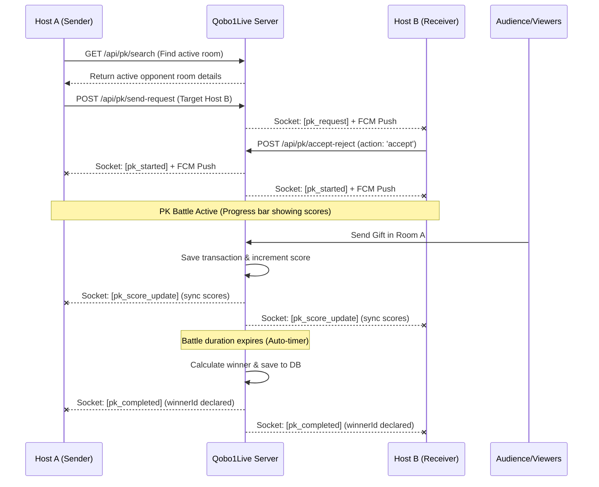

# PK Battle Flow — Mobile API & Admin Panel Integration Guide

This guide details the complete API endpoints, data formats, Push Notifications (FCM), and real-time Socket.io protocols for integrating **PK Battles** in both the Mobile client and the Admin Panel.

> **Backend status (2026-07-26):** PK Battle REST, Socket.IO (`pk_*`), FCM, pending-request persistence (120s expiry), and gift→score scoring are implemented and aligned with the mobile handoff in `docs/api/PK_BATTLE_API_AND_MOBILE_HANDOFF.md`.

---

## **1. PK Battle Flow Overview**



---

## **2. Mobile API Endpoints (`/api/pk/...`)**

### **A. Search for Opponent**
Find active live/audio rooms eligible for PK (excludes current room and rooms already in battle).
* **Endpoint**: `GET /api/pk/search?room_id=<my-room-uuid>`
* **Headers**: `Authorization: Bearer <token>`
* **Response (`200 OK`)** — preferred shape (`data.rooms` array):
  ```json
  {
    "success": true,
    "message": "Opponents found",
    "data": {
      "rooms": [
        {
          "room_id": "opponent-room-uuid",
          "title": "Opponent Room Title",
          "hostName": "Host name",
          "avatar": "https://...",
          "coverImage": "https://...",
          "room_type": "audio"
        }
      ]
    }
  }
  ```
* Mobile also accepts a single room object or `data.opponents` for backward compatibility.
### **B. Send PK Request**
Sends a challenge invitation to the opponent host.
* **Endpoint**: `POST /api/pk/send-request`
* **Headers**: `Authorization: Bearer <token>`
* **Request Body**:
  ```json
  {
    "room_id": "my-room-uuid-string",
    "target_room_id": "opponent-room-uuid-string",
    "duration": 300 // Duration in seconds (optional, default 300)
  }
  ```
* **Response (`200 OK`)**:
  ```json
  {
    "success": true,
    "message": "PK request sent",
    "data": {
      "request_id": "my-room-uuid-string",
      "room_id": "my-room-uuid-string",
      "target_room_id": "opponent-room-uuid-string",
      "duration": 300,
      "expires_at": "2026-07-23T16:10:00.000Z",
      "status": "pending"
    }
  }
  ```

### **C. Accept or Reject PK Invitation**
Called by the challenged host to accept or decline the request.
* **Endpoint**: `POST /api/pk/accept-reject`
* **Headers**: `Authorization: Bearer <token>`
* **Request Body**:
  ```json
  {
    "room_id": "my-room-uuid-string", // The accepting room ID
    "request_id": "challenger-room-uuid-string", // The challenger's room ID
    "action": "accept", // "accept" | "reject"
    "duration": 300
  }
  ```
* **Response (`200 OK - On Accept`)**:
  ```json
  {
    "success": true,
    "message": "Battle started",
    "data": {
      "id": "battle-uuid-string",
      "room1Id": "challenger-room-uuid-string",
      "room2Id": "my-room-uuid-string",
      "room1Score": 0,
      "room2Score": 0,
      "duration": 300,
      "status": "active",
      "createdAt": "2026-07-20T17:50:00.000Z"
    }
  }
  ```
* **Response (`200 OK - On Reject`)**:
  ```json
  {
    "success": true,
    "message": "Request rejected",
    "data": {
      "request_id": "challenger-room-uuid-string",
      "status": "rejected"
    }
  }
  ```

### **D. Cancel PK Request**
Cancel an outgoing pending PK challenge.
* **Endpoint**: `POST /api/pk/cancel-request`
* **Headers**: `Authorization: Bearer <token>`
* **Request Body**:
  ```json
  {
    "room_id": "challenger-room-uuid-string",
    "request_id": "pk-request-uuid-string"
  }
  ```
* **Response (`200 OK`)**:
  ```json
  {
    "success": true,
    "message": "PK request cancelled",
    "data": {
      "request_id": "pk-request-uuid-string",
      "status": "cancelled"
    }
  }
  ```
* Pending requests auto-expire after **120 seconds** on the backend.
### **E. End Active Battle**
Host-forced or server-forced end of battle.
* **Endpoint**: `POST /api/pk/end`
* **Headers**: `Authorization: Bearer <token>`
* **Request Body**:
  ```json
  {
    "battle_id": "battle-uuid-string",
    "room_id": "my-room-uuid-string",
    "reason": "host_leave"
  }
  ```
* **Response (`200 OK`)**:
  ```json
  {
    "success": true,
    "message": "Battle ended",
    "data": {
      "status": "cancelled"
    }
  }
  ```

### **F. Fetch Battle Live Status**
* **Endpoint**: `GET /api/pk/status?battle_id=<battle-uuid-string>`
* **Response (`200 OK`)**:
  ```json
  {
    "success": true,
    "message": "Current PK status",
    "data": {
      "id": "battle-uuid-string",
      "battle_id": "battle-uuid-string",
      "room1Id": "challenger-room-uuid-string",
      "room2Id": "my-room-uuid-string",
      "room1Score": 4500,
      "room2Score": 3200,
      "duration": 300,
      "remainingSeconds": 142,
      "status": "active",
      "winnerId": "uuid", // null if draw or in progress
      "winner_id": "uuid"
    }
  }
  ```

### **G. Get Active Battle for Room**
Fetch any currently active PK battle or pending request for the room.
* **Endpoint**: `GET /api/pk/active?room_id=<room-uuid-string>`
* **Response (`200 OK`)**:
  ```json
  {
    "success": true,
    "message": "Active battle status",
    "data": {
      "request": null,
      "battle": {
         // Same properties as status payload if active battle exists
      }
    }
  }
  ```

---

## **3. Real-Time Socket.io Events**

### **A. Challenge Received (`pk_request`)**
* **Emitted to**: Opponent Room ID (`target_room_id`)
* **Payload**:
  ```json
  {
    "type": "pk_request",
    "notification_id": "pk-req-...",
    "request_id": "challenger-room-uuid",
    "battle_duration": "300",
    "expires_at": "2026-07-23T16:10:00.000Z",
    "room_id": "my-room-uuid",
    "sender_room_id": "challenger-room-uuid",
    "sender_host_id": "host-a-id",
    "sender_host_name": "Host A",
    "sender_room_title": "Host A Room",
    "sender_avatar": "https://...",
    "target_room_id": "opponent-room-uuid",
    "target_host_id": "host-b-id"
  }
  ```

### **B. Battle Started (`pk_started` and `pk_accepted`)**
* **Emitted to**: Both Room IDs
* **Payload**:
  ```json
  {
    "type": "pk_started", // or "pk_accepted" for sender
    "notification_id": "pk-acc-...",
    "battle_id": "battle-uuid",
    "request_id": "challenger-room-uuid",
    "duration": "300",
    "status": "active",
    "room_id": "my-room-uuid",
    "opponent_room_id": "opponent-room-uuid"
  }
  ```

### **C. Invitation Rejected (`pk_rejected`)**
* **Emitted to**: Challenger Room ID (`request_id`)
* **Payload**:
  ```json
  {
    "request_id": "challenger-room-uuid",
    "status": "rejected"
  }
  ```

### **D. Invitation Cancelled (`pk_cancelled`)**
* **Emitted to**: Opponent Room ID
* **Payload**:
  ```json
  {
    "request_id": "challenger-room-uuid",
    "status": "cancelled"
  }
  ```

### **E. Score Updated (`pk_score_update`)**
* **Emitted to**: Both Room IDs
* **Triggered by**: Sending a virtual gift in either room during an active PK battle (gift coin value is added to that room’s PK score).
* **Payload**:
  ```json
  {
    "battle_id": "battle-uuid-string",
    "room1Id": "uuid-a",
    "room2Id": "uuid-b",
    "room1Score": 1250,
    "room2Score": 980,
    "remainingSeconds": 190,
    "lastGift": {
      "sender_id": "user-id",
      "sender_name": "Viewer name",
      "receiver_room_id": "uuid-a",
      "gift_id": "gift-id",
      "gift_name": "Rose",
      "coin_value": 100
    }
  }
  ```

### **F. Battle Completed (`pk_completed`)**
* **Emitted to**: Both Room IDs
* **Triggered by**: Timer expiry or API force end.
* **Payload**:
  ```json
  {
    "battleId": "battle-uuid-string",
    "winnerId": "winning-room-uuid", // Null if draw
    "room1Id": "uuid-a",
    "room2Id": "uuid-b",
    "room1Score": 12500,
    "room2Score": 15000,
    "status": "completed" // or "cancelled"
  }
  ```

---

## **4. FCM Push Notifications (`type` keys)**

The backend now fires standard FCM pushes to host users with a high-priority data payload.

| `type` | Recipient | Action / Trigger |
|---|---|---|
| `pk_request` | Opponent Host | Sent upon `/send-request`. Contains full request details. |
| `pk_accepted` | Challenger Host | Sent when opponent accepts the PK request. |
| `pk_rejected` | Challenger Host | Sent when opponent rejects the PK request. |
| `pk_cancelled`| Opponent Host | Sent when challenger cancels the pending request. |
| `pk_started` | Both Hosts | Sent concurrently when battle activates. |
| `pk_completed`| Both Hosts | Sent upon battle end / timer expiry. |

_Note: Payload data formats strictly match the socket events listed above. FCM data keys only contain strings._
